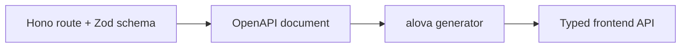

# Hono OpenAPI Starter

一套面向真实业务起步的 TypeScript 全栈模板：后端使用 Hono、Drizzle、Better Auth 和 `@hono/zod-openapi`，前端使用 React、TanStack Router、alova 和 Base UI（shadcn）。

它不只是一个能返回 `Hello World` 的脚手架。仓库已经打通认证、组织与权限、项目管理、审计日志、OpenAPI 契约、前端管理界面和测试基础设施，适合作为后台管理系统或内部业务平台的工程基线。

## 内置能力

| 领域 | 已提供的能力 |
| --- | --- |
| API | Hono + Zod 路由契约、统一响应 envelope、错误码、请求校验、Scalar API Reference |
| 认证 | Better Auth 邮箱密码登录、cookie / bearer session、个人资料与密码修改 |
| 授权 | 唯一系统根、分级管理子树、目标组织 PEP、全局角色、直接 allow / deny、组织范围继承与委派上限 |
| 数据 | PostgreSQL + Drizzle schema、migration、开发 seed、生产首次管理员 bootstrap |
| 前端 | React 19、TanStack Router / Form / Table、alova 请求层、OpenAPI 客户端生成、Base UI（shadcn） |
| 业务基线 | Dashboard、用户 / 角色 / 组织管理、项目管理、系统设置扩展点（当前无内置 key）、操作日志 |
| 工程治理 | feature 垂直切片、ESLint 边界约束、Vitest 单元 / 契约 / 集成测试、Playwright 真实浏览器 E2E、结构化日志与 requestId |

## 技术栈

| 后端 | 前端 | 工程 |
| --- | --- | --- |
| Node.js 24、Hono、TypeScript | React 19、Vite、TypeScript | pnpm workspace |
| `@hono/zod-openapi`、Zod、Scalar | TanStack Router / Form / Table | ESLint、Vitest |
| Drizzle ORM、PostgreSQL | alova、`@alova/wormhole` | Testcontainers |
| Better Auth、LogLayer | Tailwind CSS、Base UI（shadcn） | OpenAPI 驱动的类型生成 |

## 快速开始

### 1. 准备环境

- Node.js 24+
- pnpm 11.9.0（版本以根 `package.json` 的 `packageManager` 为准）
- 可访问的 PostgreSQL 实例
- Docker（运行后端集成测试和 Playwright E2E 时需要）

仓库当前不内置 PostgreSQL Compose；请先创建空数据库，并准备好连接串。

### 2. 安装依赖并创建本地配置

```sh
pnpm install

cp apps/backend/.env.example apps/backend/.env
cp apps/frontend/.env.example apps/frontend/.env
```

至少修改 `apps/backend/.env` 中的：

- `DATABASE_URL`：本地 PostgreSQL 连接串；
- `BETTER_AUTH_SECRET`：长度至少 32 位的随机密钥；
- `BETTER_AUTH_URL`、`BETTER_AUTH_TRUSTED_ORIGINS`：端口或访问域名变化时同步调整。

前端开发环境默认通过 Vite proxy 访问 `http://localhost:3001`，因此 `VITE_API_BASE_URL` 可以留空。

### 3. 初始化开发数据库

```sh
pnpm --filter backend db:migrate
pnpm --filter backend db:seed
```

`db:seed` 只允许在非生产环境执行，会创建演示组织、项目和管理员：

```txt
邮箱：dev@example.com
密码：dev-password
```

这些凭据只用于本地开发，不应复用到部署环境。

### 4. 启动前后端

分别打开两个终端：

```sh
pnpm --filter backend dev
```

```sh
pnpm --filter frontend dev
```

启动后可访问：

| 地址 | 用途 |
| --- | --- |
| <http://localhost:5173> | 前端管理界面 |
| <http://localhost:3001/healthz> | 后端存活检查 |
| <http://localhost:3001/reference> | Scalar API Reference（仅开发环境） |
| <http://localhost:3001/openapi.json> | OpenAPI 文档（开发环境默认开放） |

## OpenAPI 到前端的契约链路

业务 API 在后端通过 `createRoute(...)` 和 `app.openapi(...)` 定义，OpenAPI 是接口契约的源码真相；前端使用 `@alova/wormhole` 读取该文档并生成类型安全的 API 定义。



修改后端 API 后，先启动后端，再重新生成前端客户端：

```sh
pnpm --filter frontend gen:api
```

生成完成后应同时检查前端类型和调用方，避免只更新生成物而遗漏消费端变更。

## 常用命令

以下命令均从仓库根目录执行。

| 目标 | 命令 |
| --- | --- |
| 全仓 lint | `pnpm lint` |
| 前后端类型检查 | `pnpm typecheck` |
| 前后端单元测试 | `pnpm test` |
| 前后端构建 | `pnpm build` |
| 后端类型检查 | `pnpm --filter backend typecheck` |
| 后端单元测试 | `pnpm --filter backend test` |
| 后端集成测试 | `pnpm --filter backend test:integration` |
| 后端全部测试 | `pnpm --filter backend test:all` |
| 后端构建 | `pnpm --filter backend build` |
| 后端生产 release | `pnpm package:backend` |
| 前端类型检查 | `pnpm --filter frontend typecheck` |
| 前端测试 | `pnpm --filter frontend test` |
| Playwright E2E | `pnpm test:e2e` |
| 前端构建 | `pnpm --filter frontend build` |
| 生成数据库 migration | `pnpm --filter backend db:generate` |
| 执行数据库 migration | `pnpm --filter backend db:migrate` |
| 打开 Drizzle Studio | `pnpm --filter backend db:studio` |

后端集成测试和 Playwright E2E 都使用 Testcontainers，需要本机 Docker daemon 正常运行。E2E 会在仓库外生成独立 backend production release，使用其中的编译产物执行 migration、开发 seed 和服务启动，再以 Vite preview 启动前端；不会借用仓库根依赖或本地数据库。首次运行前安装目标浏览器，例如：

```sh
pnpm --filter e2e exec playwright install chromium
```

日常开发默认先运行单元测试；涉及数据库 schema、事务或 PostgreSQL 行为时再补集成测试，需要验证跨前后端真实链路时运行 `pnpm test:e2e`。

## 生产首次初始化

生产环境不要运行 `db:seed`。先在与目标 OS/CPU 一致的 Node.js 24 构建环境生成 portable release：

```sh
pnpm package:backend
```

产物位于 `.artifacts/backend/`，包含编译后的 JavaScript、source map、Drizzle migrations 和隔离的 production dependencies；不包含 `.env`、日志、源码或测试，也不安装 package metadata 中声明的 devDependencies。发布校验还会拒绝 Vitest、Vite、TypeScript、Drizzle Kit 等非运行时工具链进入依赖图。将整个目录作为一个不可变版本发布，不要只复制 `dist/`。

部署环境通过平台环境变量或 release 外的 EnvironmentFile 配置：

- `NODE_ENV=production`
- `BOOTSTRAP_ADMIN_EMAIL`
- `BOOTSTRAP_ADMIN_PASSWORD`
- `BOOTSTRAP_ROOT_ORG_ID`

解包到版本目录后，依次使用同一个候选 release 执行 migration、首次 bootstrap 和应用启动。生产入口直接使用 Node.js，不要求目标机安装 pnpm：

```sh
node --enable-source-maps /opt/hono-openapi-starter/releases/<version>/dist/commands/migrate.js
node --enable-source-maps /opt/hono-openapi-starter/releases/<version>/dist/commands/bootstrap-admin.js
node --enable-source-maps /opt/hono-openapi-starter/releases/<version>/dist/index.js
```

bootstrap 只用于空环境首次部署，负责创建唯一系统根和第一个 admin；普通版本发布不重复执行。业务 API 只能创建子组织，不提供第二个根或替换根的入口。成功后应从部署环境中移除 `BOOTSTRAP_ADMIN_PASSWORD`，后续用户与授权通过管理界面或 API 维护。

migration 必须作为切流前的独立 release job 执行一次，不能由每个应用副本启动时并发执行。应用启动后等待 `/healthz` 与 `/readyz` 成功再切流；数据库变更继续遵循 expand/contract，应用回切不等于自动回滚 migration。

生产环境默认不公开 `/openapi.json`，`/reference` 也不会挂载；确需公开 OpenAPI 时显式设置 `OPENAPI_PUBLIC=true`。

## 项目结构

```txt
.
├── apps/
│   ├── backend/          # Hono API、数据库、认证授权与后端 feature
│   ├── frontend/         # React 管理端、路由、页面与前端 feature
│   └── e2e/               # Playwright runner、fixtures 与代表性浏览器流程
├── docs/
│   ├── architecture/     # 当前架构事实与边界
│   ├── conventions/      # 后端、前端和共享开发规范
│   ├── features/         # 已实现 feature 的设计与契约说明
│   ├── adr/              # 已接受的长期架构决策
│   └── checklists/       # 安全、可观测性、IAM 等验收清单
├── AGENTS.md             # 维护者与 coding agent 工作指南
├── pnpm-workspace.yaml   # workspace 与统一依赖版本目录
└── eslint.config.mjs     # 全仓 lint 与模块边界规则
```

前后端业务代码均优先按 `features/<feature>` 垂直切片组织。后端 `core/` 只承载跨业务基础设施，前端 `routes/` 只负责路由装配；不要把业务逻辑重新堆回全局横向目录。

## 文档导航

- [文档地图](docs/README.md)：按任务找到应该先读的架构、规范和 feature 文档；
- [架构总览](docs/architecture/overview.md)：理解垂直切片、core / db 边界和请求生命周期；
- [后端开发流程](docs/conventions/backend/development-workflow.md)：新增 API、schema、migration 与测试；
- [前端开发流程](docs/conventions/frontend/development-workflow.md)：新增页面、路由、请求与测试；
- [前端测试规范](docs/conventions/frontend/testing.md)：Vitest 单测与 Playwright E2E 的分工、命令和范围；
- [ADR 索引](docs/adr/README.md)：查看长期技术决策及其取舍；
- [安全验收清单](docs/checklists/security-checklist.md)：发布前检查认证、授权、输入、日志和配置；
- [Agent 工作指南](AGENTS.md)：仓库维护规则、质量门禁与禁止模式。

README 负责稳定的项目入口；更细的实现约束以 `docs/` 中对应文档和当前代码为准。文档与实现不一致时，应回到路由契约、schema、配置和测试核对事实，并同步修正文档。
