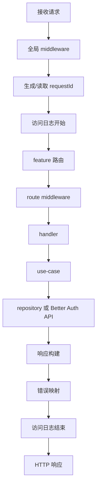

# 请求生命周期

## 标准链路

## 关键节点职责

### Global Middlewares

负责所有请求的横切能力：

- request id
- secure headers
- CORS
- body limit
- access log
- error handler

### Feature Router

按 `features/<feature>/index.ts` 注册到主 app。

### Route Middleware

只放和当前 route 强相关的中间件，例如：

- `requireAuth()`
- `requirePermission(...)`
- idempotency key
- route-specific validation

### Handler

handler 必须保持很薄，只负责：

- 读取已校验输入
- 读取 context
- 调用 service/use-case
- 返回统一响应

### Use Case / Service

负责：

- 业务规则
- 权限策略调用
- 事务边界
- 调用 repository

### Repository

负责数据库 IO。

不返回 HTTP response，不依赖 Hono context。

### Error Mapper

所有异常最终统一转换成 envelope。

未知错误对外隐藏内部细节，但日志记录完整错误信息。
