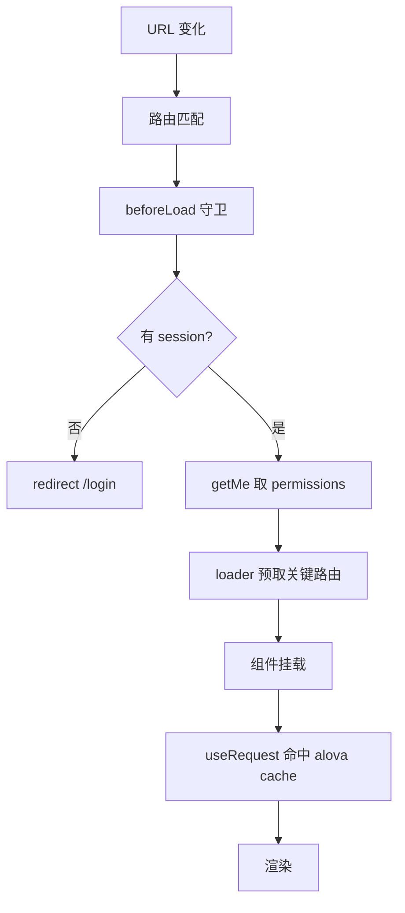

# 前端请求生命周期

从 URL 到渲染的完整链路。

## 生命周期

## 阶段说明

1. **路由匹配**:TanStack Router 文件路由匹配 URL。
2. **beforeLoad 守卫**:
   - `_authenticated` layout:无 session -> `redirect /login`;有 -> `await Apis.Me.getMe()` 取 permissions,合并到 context 下钻子路由。
   - 单路由 `beforeLoad`:调 `requirePermission(context.auth.permissions, "roles.read")`,不足 `redirect /403`。
3. **loader 预取**(仅关键路由):`await Apis.IAM.listRoles()` 写 alova cache。
4. **组件挂载**:`useRequest(() => Apis.IAM.listRoles())` 命中 loader 写入的 cache,无二次请求。
5. **alova 请求**(cache 未命中):fetch(同源 proxy 带 cookie)-> `responded` 剥 envelope -> 返回 data。
6. **渲染**:组件用 data 渲染。

## 守卫不是授权边界

前端守卫只做 UX(挡路由/隐藏菜单)。真正授权在后端 `PermissionChecker`(见 [backend/authorization](../../conventions/backend/authorization.md))。前端 permissions 缓存过期不构成安全问题(后端兜底)。

## 登录/登出

登录:`signIn` 成功后 `router.navigate` 到 `redirect` 目标(或 `/dashboard`),触发 `_authenticated` 重新取 permissions。登出:`signOut` 后 `router.invalidate()` 重走守卫(session 变 null -> 重定向 `/login`)。session 过期(业务 API alova 401)由 `responded.onSuccess` 统一 hard-nav `/login?redirect=<当前>`。session 来自 Better Auth `useSession`(React-land),App 等 `isPending` 结束再渲染 RouterProvider,避免 beforeLoad 拿到未 resolve 的 session。

详细规范见 [routing](../../conventions/frontend/routing.md)、[auth](../../conventions/frontend/auth.md)、[api-alova](../../conventions/frontend/api-alova.md)。
