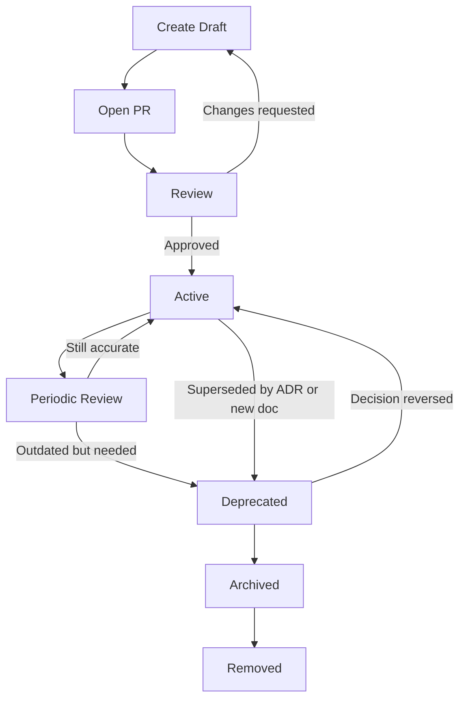

# 文档系统规范

## 目标

文档不是事后补充材料，而是模板的一等产物。

文档的目标不是“把代码再解释一遍”，而是明确：

* 架构为什么这样设计
* 功能边界如何划分
* API 契约如何被消费
* 团队如何协作
* 文档如何随着代码持续演进

源码真相分工：

| 类型 | Source of Truth |
| --- | --- |
| 入口地图 | `README.md`、`docs/README.md`、`AGENTS.md` |
| API 契约 | `createRoute` + OpenAPI |
| 架构决策 | `docs/adr` |
| 架构说明 | `docs/architecture` |
| Feature 设计 | `docs/features/{backend,frontend}` |
| 共享包 | `docs/packages` |
| 图 | `docs/diagrams/*.mmd` |
| 开发规范 | `docs/conventions/{shared,backend,frontend}` |
| 验收清单 | `docs/checklists` |

## 文档路由与阅读顺序

文档维护必须先按任务路由读取，不要无差别遍历整个 `docs/`。默认顺序：

1. `README.md`：确认 repo 入口和稳定链接。
2. `docs/README.md`：确认任务应该读取哪些文档。
3. `AGENTS.md`：确认维护者和 agent 的工作循环、禁止行为和质量门禁。
4. `docs/architecture/overview.md`：确认当前架构原则。
5. `docs/architecture/backend/directory-structure.md` 或 `docs/architecture/frontend/directory-structure.md`：确认目录职责、边界和禁止模式。
6. `docs/adr/README.md`，再读相关 `docs/adr/*.md`：确认长期决策历史。
7. 与任务直接相关的 `docs/conventions/{shared,backend,frontend}/*.md`：确认执行规范。
8. 涉及 feature 时读 `docs/features/{backend,frontend}/_template.md` 和具体 feature 文档。
9. 涉及验收时读相关 `docs/checklists/*.md`。

读完文档后必须回到当前事实：用 `rg` 或 `find` 定位当前实现、测试、配置和已有文档，确认文档没有脱离真实状态。

## 当前 docs 目录

```txt
docs/
  README.md

  architecture/
    overview.md
    backend/{directory-structure, request-lifecycle}.md
    frontend/{directory-structure, request-lifecycle}.md

  conventions/
    shared/{commenting, documentation-system, ci-cd-security-observability}.md
    backend/{api-openapi, response-envelope, error-code-system, auth-better-auth, authorization, database-drizzle, logging-loglayer, development-workflow, testing-strategy}.md
    frontend/{api-alova, routing, auth, state-cache, development-workflow, testing}.md

  features/
    backend/{_template, iam, projects}.md
    frontend/_template.md

  packages/_template.md

  adr/
    README.md
    0001-feature-slices.md
    0002-unified-response-envelope.md
    0003-keep-better-auth-native.md
    0004-authorization-layer.md
    0005-frontend-wormhole-selection.md
    0006-frontend-architecture.md

  diagrams/
  checklists/
```

执行计划不进 `docs/`，放在 Claude Code 的 `.claude/plans/` 目录（见 [execution-plan](../../../.claude/skills/execution-plan/SKILL.md) 技能）。每份计划带 frontmatter `status: draft`，完成后转 `Active` 或归档。

## 推荐扩展目录

以下目录和文件只有在项目实际需要时再创建。未创建前，它们只代表治理建议，不代表当前事实。

| 路径 | 使用场景 |
| --- | --- |
| `docs/reports/` | 实际运行、回填、重跑和数据校验记录；必须包含命令、时间、范围和结果 |
| `docs/references/` | 远端接口、OpenAPI、数据字典、样例图片、服务器协议等可查事实 |
| `docs/archive/` | 仅用于历史追溯的归档文档 |
| `docs/architecture/auth-and-permissions.md` | 当认证/权限超出 Better Auth 集成规范时新增 |
| `docs/architecture/data-access.md` | 当数据访问策略超出 Drizzle 规范时新增 |
| `docs/architecture/observability.md` | 当可观测性策略超出日志和 CI/CD 规范时新增 |

## 新增 feature 时必须更新哪些文档

至少更新：

1. `docs/features/{backend,frontend}/<feature>.md`
2. OpenAPI route definitions
3. 错误码文档
4. 权限文档，如果涉及授权
5. 数据库文档，如果涉及表结构
6. Mermaid 图，如果引入新的关键流程
7. ADR，如果引入模板级或架构级决策

## 文档和代码保持一致的方法

不要靠“记得同步”，而是靠机制：

1. API schema 不在 Markdown 里手写，引用 operationId。
2. CI 生成并 lint OpenAPI。
3. 新 feature PR 必须包含 feature 文档。
4. 新错误码必须更新错误码注册表和文档。
5. 新权限必须更新权限矩阵。
6. 重要架构决策必须写 ADR。
7. PR checklist 必须包含文档检查项。
8. CODEOWNERS 必须覆盖关键文档。
9. 定期复查 `Active` 文档是否仍然准确。

## 文档生命周期闭环

文档不是一次性产物，而是和代码、API 契约、数据库 schema、错误码、配置项一起演进的工程资产。

所有重要文档都必须进入明确的生命周期管理，避免出现：

* 代码已变，文档未变
* 文档存在，但没人信
* 旧文档误导新人
* 决策发生变化，但没有留下历史记录
* 文档删除后无法追溯原因

文档生命周期必须覆盖：

```txt
创建 → 评审 → 生效 → 同步 → 复查 → 废弃 → 归档 → 删除
```

## 文档元信息

所有正式文档必须在文件顶部声明 frontmatter，用于标记文档状态、owner、复查时间以及与代码/API/ADR 的映射关系。

```md
---
title: Users Feature
status: Active
owner: backend
lastReviewedAt: 2026-06-03
reviewedBy: backend
relatedCode:
  - src/features/users
relatedOpenAPI:
  - getUserById
  - listUsers
relatedErrorCodes:
  - USER_NOT_FOUND
  - USER_EMAIL_ALREADY_EXISTS
relatedADR:
  - docs/adr/0003-unified-response-envelope.md
---
```

临时草稿、会议记录、一次性调研笔记可以不强制完整 frontmatter，但不能进入 `Active` 状态。

## 生命周期状态

每份正式文档必须处于以下状态之一：

| 状态 | 含义 | 使用场景 |
| --- | --- | --- |
| Draft | 草稿 | 方案设计中，内容尚未评审，不可作为实现依据 |
| Review | 评审中 | 已提交 PR，等待技术评审或业务确认 |
| Active | 生效中 | 已评审通过，是当前实现与协作依据 |
| Deprecated | 已废弃 | 旧方案仍需保留一段时间，但不应再用于新开发 |
| Archived | 已归档 | 仅作为历史记录保留，不再维护 |
| Removed | 已移除 | 文档已无保留价值，允许删除 |

## 状态流转规则

文档状态必须按以下规则流转：

| 当前状态 | 允许流转到 | 说明 |
| --- | --- | --- |
| Draft | Review、Removed | 草稿可以进入评审，也可以直接丢弃 |
| Review | Draft、Active | 评审未通过回到草稿，评审通过后生效 |
| Active | Deprecated | 生效文档被新方案替代时进入废弃状态 |
| Deprecated | Active、Archived | 如果废弃判断有误可以恢复，否则进入归档 |
| Archived | Removed | 归档文档确认无历史价值后才允许删除 |
| Removed | - | 已删除文档不可再流转 |

禁止行为：

* 不允许 `Draft` 直接进入 `Active`，必须经过 review。
* 不允许 `Active` 直接进入 `Removed`，必须先 `Deprecated` 或 `Archived`。
* 不允许无 owner 的文档进入 `Active`。
* 不允许无 `lastReviewedAt` 的文档进入 `Active`。
* 不允许删除 ADR，ADR 只能被新 ADR supersede。
* 不允许悄悄废弃或删除文档，必须在 PR 中说明原因。

## 不同文档类型的生命周期策略

不同类型文档的生命周期策略不同，不能用同一套删除和修改规则粗暴处理。

| 文档类型 | 是否允许频繁修改 | 是否允许删除 | 生命周期策略 |
| --- | --- | --- | --- |
| Architecture | 否 | 谨慎删除 | 重大架构变化应通过 ADR 说明原因 |
| Conventions | 可以 | 谨慎删除 | 规范变化必须同步开发流程和 PR checklist |
| Feature Docs | 可以 | 可以归档 | 随 feature 演进更新，feature 下线后归档 |
| ADR | 否 | 原则上不删除 | ADR 只记录决策历史，被替代时标记 superseded |
| Diagrams | 可以 | 可以 | 必须与对应 architecture 或 feature 文档保持一致 |
| README / Onboarding | 可以 | 谨慎删除 | 需要更高频复查，避免新人被过期内容误导 |

ADR 是决策历史，不应被直接改写。
如果新的决策替代了旧 ADR，应新增 ADR，并在旧 ADR 中标记 `supersededBy`。

示例：

```md
---
title: Use Unified Response Envelope
status: Deprecated
supersededBy: docs/adr/0008-use-problem-details-for-public-api.md
---
```

## 文档创建

出现以下情况时，必须创建或更新文档：

| 变更类型 | 必须更新的文档 |
| --- | --- |
| 新增 feature | `docs/features/{backend,frontend}/<feature>.md` |
| 新增或修改 API | OpenAPI route 定义、feature 文档、API 规范相关说明 |
| 修改响应格式 | `docs/conventions/backend/response-envelope.md`、相关 ADR |
| 新增错误码 | `docs/conventions/backend/error-code-system.md`、feature 文档 |
| 修改认证/权限策略 | `docs/conventions/backend/auth-better-auth.md`、feature 文档；必要时新增认证/权限架构文档 |
| 修改数据库表结构 | `docs/conventions/backend/database-drizzle.md`、feature 文档；必要时新增数据访问架构文档 |
| 引入新基础设施 | architecture 文档、ADR |
| 修改目录结构或边界规则 | `docs/architecture/{backend,frontend}/directory-structure.md`、ADR |
| 修改日志、监控、审计策略 | `docs/conventions/backend/logging-loglayer.md`、architecture 文档 |
| 修改开发流程 | `docs/conventions/{backend,frontend}/development-workflow.md` |
| 新增环境变量 | 环境变量说明、部署说明 |
| 修改部署或迁移流程 | 部署文档、migration 文档、ADR |

原则：

* 代码变更如果影响外部行为，必须同步 API 文档。
* 代码变更如果影响团队协作方式，必须同步规范文档。
* 代码变更如果改变长期技术决策，必须新增或更新 ADR。
* 代码变更如果影响权限、数据、错误码或日志字段，必须同步对应文档。
* 代码变更如果只属于局部实现细节，通常不需要新增文档，但必要时应补充代码注释或 TSDoc。

## 文档评审

文档评审和代码评审必须在同一个 PR 中完成。

PR 中如果包含以下变更，reviewer 必须检查对应文档是否同步：

* 新增或修改 API
* 新增或修改数据库 schema
* 新增或修改错误码
* 新增或修改认证、授权、权限规则
* 新增或修改日志字段
* 新增或修改 feature 边界
* 新增或修改环境变量
* 新增或修改部署、迁移、回滚流程
* 新增或修改开发规范
* 新增或修改架构决策

PR 描述中必须包含文档检查项：

```md
## Documentation Checklist

- [ ] 是否新增或更新了 feature 文档
- [ ] 是否新增或更新了 OpenAPI 文档
- [ ] 是否新增或更新了错误码文档
- [ ] 是否新增或更新了数据库/迁移说明
- [ ] 是否新增或更新了认证/权限说明
- [ ] 是否新增或更新了日志/审计说明
- [ ] 是否新增或更新了 Mermaid 图
- [ ] 是否需要新增 ADR
- [ ] 不需要更新文档，原因：
```

如果 PR 影响了文档但没有同步更新，PR 不允许合并。

## 文档发布

文档发布与代码发布保持一致。

推荐规则：

* `main` 分支上的 `Active` 文档代表当前生产版本或即将发布版本。
* API 文档以 OpenAPI 生成结果为准。
* 手写 Markdown 文档不得重复描述完整 API schema，只引用 operationId、tag、错误码和关键行为。
* 版本发布时，需要检查 release note 是否引用了相关文档变化。
* 重大变更发布时，必须更新 ADR 或新增 ADR。
* 文档变更应跟随对应代码变更一起发布，避免代码和文档跨版本错位。

如果项目存在多版本 API，例如 `/api/v1`、`/api/v2`，文档必须显式标注适用版本：

```md
---
apiVersion: v1
status: Active
---
```

## 文档同步机制

文档同步不依赖个人记忆，而要通过流程和自动化约束。

推荐建立以下同步机制：

| 机制 | 目的 |
| --- | --- |
| PR checklist | 强制开发者自查文档变更 |
| CODEOWNERS | 关键文档必须由对应 owner 审核 |
| OpenAPI CI | 校验 API 契约是否可生成、可 lint、可 validate |
| dead link check | 检查文档内部链接是否失效 |
| docs lint | 检查 Markdown 格式、标题层级、代码块语言 |
| ADR required rule | 重大技术决策必须留下 ADR |
| scheduled review | 定期复查 Active 文档是否仍然准确 |
| docs index check | 检查新增文档是否被 README 或索引引用 |
| frontmatter check | 检查正式文档是否包含必要元信息 |

模板落地到具体工程后，CI 中建议至少包含：

```txt
pnpm docs:lint
pnpm docs:links
pnpm docs:frontmatter
pnpm openapi:generate
pnpm openapi:lint
pnpm openapi:validate
```

## 文档复查

所有长期有效文档都必须定期复查。

建议复查周期：

| 文档类型 | 复查周期 | 说明 |
| --- | --- | --- |
| architecture | 每季度 | 确认架构边界、请求流程、认证流程是否仍然准确 |
| conventions | 每季度 | 确认规范是否仍然符合团队实践 |
| features | 每个大版本前 | 确认 feature 行为、API、错误码、权限说明是否准确 |
| ADR | 不定期 | ADR 通常不修改，只在被新 ADR 替代时标记 deprecated |
| diagrams | 每季度 | 确认 Mermaid 图与真实代码路径一致 |
| README / onboarding | 每月 | 新人文档最容易过期，需要更频繁维护 |

文档复查时需要更新 frontmatter：

```md
---
lastReviewedAt: 2026-06-03
reviewedBy: backend
---
```

如果文档内容已经不准确，但暂时无法立即修复，必须先标记为 `Deprecated`，或者在顶部加明显警告：

```md
> Warning: This document is outdated and should not be used as implementation reference.
```

## 文档废弃与归档

文档废弃必须显式标记，不能悄悄删除。

当以下情况发生时，应将文档标记为 `Deprecated`：

* API 版本即将下线
* feature 被新实现替代
* 技术方案被新 ADR 替代
* 目录结构或开发规范发生重大变化
* 文档描述的流程已经不再适用
* 文档内容不再准确，但仍有历史参考价值

Deprecated 文档必须说明：

* 为什么废弃
* 替代文档在哪里
* 预计归档或删除时间
* 是否仍影响线上系统

示例：

```md
---
status: Deprecated
deprecatedAt: 2026-06-03
replacement: docs/features/users-v2.md
removeAfter: 2026-09-01
---

> This document has been deprecated. Use `docs/features/users-v2.md` instead.
```

当文档仅用于历史追溯时，应移动到：

```txt
docs/archive/
```

或者保留在原位置但标记：

```md
---
status: Archived
---
```

## 文档删除

只有满足以下条件时，才允许删除文档：

* 文档已经标记为 `Deprecated` 或 `Archived`
* 已有替代文档，或确认不再需要替代文档
* 没有其他文档链接到它
* 没有活跃 feature、API、ADR 依赖它
* 删除记录出现在 PR 和 changelog 中
* 文档 owner 已确认可以删除

不允许直接删除仍处于 `Active` 状态的规范文档、架构文档和 ADR。

ADR 原则上不删除，只允许被新 ADR supersede。

## 文档与代码的映射关系

正式文档必须尽量声明它和代码、API、错误码、ADR 的关系。

推荐在文档 frontmatter 中维护：

```md
---
relatedCode:
  - src/features/users
  - src/db/schema/users.ts
relatedOpenAPI:
  - getUserById
  - listUsers
relatedErrorCodes:
  - USER_NOT_FOUND
  - USER_EMAIL_ALREADY_EXISTS
relatedADR:
  - docs/adr/0003-unified-response-envelope.md
---
```

这样可以让 reviewer 快速判断：

* 修改代码时是否需要同步文档
* 修改文档时是否需要同步代码
* 文档是否已经脱离真实实现
* 哪些 API、错误码、数据模型受影响

## 文档 owner

每份正式文档都必须有 owner。

owner 可以是个人，也可以是团队：

```md
---
owner: backend-platform
---
```

owner 的职责：

* 保证文档内容长期准确
* 参与相关 PR review
* 定期复查文档状态
* 标记过期文档
* 决定是否归档或删除文档

无 owner 的文档容易失效，不应进入 `Active` 状态。

## 文档质量标准

一份可以进入 `Active` 状态的文档，必须满足以下标准：

* 有明确标题和目标读者
* 有 owner
* 有状态
* 有最后复查时间
* 说明适用范围和不适用范围
* 引用相关代码、API、错误码或 ADR
* 不复制粘贴大量会快速过期的实现细节
* Mermaid 图和代码路径一致
* 不包含过期链接
* 不和 OpenAPI、错误码注册表、数据库 schema 冲突
* 不和已有 ADR 冲突
* 如果与旧文档冲突，必须说明替代关系

## 文档生命周期流程



## 最小闭环要求

为了避免文档系统过重，模板默认只强制以下最小闭环：

1. 新增或修改 feature，必须更新 `docs/features/{backend,frontend}/<feature>.md`。
2. 新增或修改 API，必须更新 OpenAPI route 定义。
3. 新增或修改错误码，必须更新错误码注册表和错误码文档。
4. 新增或修改数据库 schema，必须更新 migration，并在 feature 文档中说明影响。
5. 新增或修改认证/权限规则，必须更新权限说明。
6. 重大技术决策必须新增 ADR。
7. 每份正式文档必须有 `status`、`owner`、`lastReviewedAt`。
8. PR checklist 必须包含文档检查项。
9. `Active` 文档不得无替代方案直接删除。
10. ADR 不得删除，只能被新 ADR supersede。
11. 进入 `Active` 状态的文档必须经过 review。
12. 文档 owner 必须参与关键文档的评审和废弃决策。
