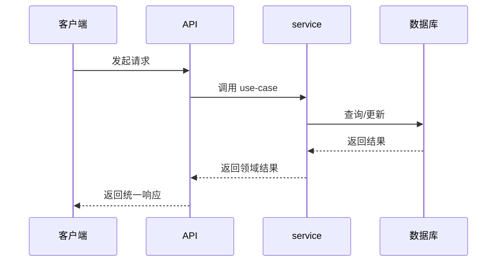

# Feature: <FeatureName>

## 1. Background

说明为什么需要这个 feature。

## 2. Goals

-

## 3. Non-goals

-

## 4. API Surface

| Method | Path | OperationId | Auth | Description |
| --- | --- | --- | --- | --- |
| GET | `/api/v1/...` | `featureAction` | yes/no | |

## 5. Request / Response

说明主要请求体、响应体和分页策略。

## 6. Auth & Permissions

新增权限时，在 feature 的 `permissions.ts` 中用 `as const satisfies` 声明权限数组（`<resource>.<action>` 字面量），并在 `permissions-manifest.ts` 展开到 `APP_PERMISSIONS` 汇入全局 `AppPermission`（漏登记编译报错）。

| Permission | Description |
| --- | --- |
| `<resource>.<action>` | |

## 7. Data Model

涉及哪些表、字段、关系、索引。

## 8. Error Codes

| Code | HTTP Status | Description |
| --- | --- | --- |
| `FEATURE_SOMETHING_FAILED` | 400 | |

## 9. Request Flow

## 10. Logging & Audit

说明哪些操作需要写业务日志或 audit log。

## 11. Test Cases

- unit:
- route:
- integration:
- contract:

## 12. Rollout / Migration Notes

说明是否涉及迁移、兼容、灰度、回滚。
