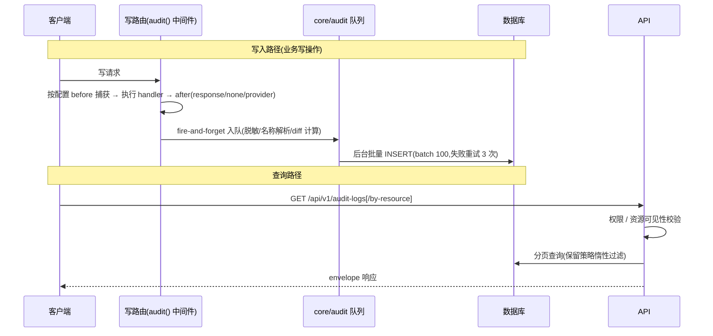

# Feature: 审计日志(audit)

## 1. Background

全项目写操作需要留痕:谁在何时对什么资源做了什么、改前改后、成功失败。基础设施(`core/audit/`)与基础选型见 [ADR-0009](../../adr/0009-audit-log.md)，模板边界和发布约束见 [ADR-0010](../../adr/0010-audit-template-boundaries.md);本文档描述 audit feature 的查询 API 与使用方式。

## 2. Goals

- 提供全局审计页查询(分页 + 筛选 + 管理子树过滤)
- 提供 by-resource 时间线(业务详情页"加载更多"式分页)
- action 目录端点,前端渲染查表(后端单一事实来源)

## 3. Non-goals

- 不记读操作;不记 401/403(权限校验在 audit() 之前)
- 不做哈希防篡改链、时间分区、审计导出、SIEM 对接(见 ADR-0009)
- 不提供 update/delete 审计记录接口(append-only)

## 4. API Surface

| Method | Path | OperationId | Auth | Description |
| --- | --- | --- | --- | --- |
| GET | `/api/v1/audit-logs` | `listAuditLogs` | `audit.read` | 全局审计列表(offset 分页 + 筛选) |
| GET | `/api/v1/audit-logs/by-resource` | `listAuditLogsByResource` | 登录(资源可见性校验) | 资源操作时间线(cursor 分页) |
| GET | `/api/v1/audit-logs/actions` | `listAuditActions` | `audit.read` | action 目录(action 代码 → 中文 label) |

## 5. Request / Response

**`listAuditLogs`** — offset 分页(`page`/`pageSize`,复用 `core/http/pagination.ts` 的 `OffsetPaginationQuerySchema`)+ 筛选:

| 参数 | 类型 | 说明 |
| --- | --- | --- |
| `page` / `pageSize` | int | 默认 1 / 25,pageSize ≤ 100 |
| `action` / `actorUserId` / `actorKeyword` / `status` | string | 按动作 / 操作者 ID / **操作者名称模糊搜索**(ilike `actor_name_snapshot`)/ 结果(success\|failure)过滤 |
| `from` / `to` | ISO datetime | 时间范围过滤 |

响应 meta:`{ page, pageSize, total, totalPages }`。列表按操作者管理子树过滤(与 IAM 可见性语义一致),并包含 `actorOrgId IS NULL` 的无归属事件(登录失败等,任何管理员可见)。

**`listAuditLogsByResource`** — cursor 分页(游标 base64 编码 `{ occurredAt, id }`,按 `occurred_at DESC, id DESC` 排序),`resourceType` + `resourceId` 必填。响应 meta:`{ nextCursor, hasMore }`(多取 1 条判断)。

**`listAuditActions`** — 返回 `[{ action, label }]` 数组,来自应用装配时注册的 action registry(当前 26 项:24 个写路由 + 登录/登出)。写路由通过 `audit({ action: descriptor })` 自动注册,认证 hook 显式注册。

全局详情日志(`AuditLog`)包含:`id` / `actorUserId` / **`actorName`(写时快照)** / `actorOrgId` / `action` / `resourceRefs`(`[{type,id,name?}]`)/ `beforeState` / `afterState` / `changedFields` / `ipAddress` / `userAgent` / `requestId` / `status` / `errorCode` / `metadata` / `occurredAt` / `recordedAt`。`beforeState`/`afterState`/`metadata` 的 OpenAPI 契约使用可递归的 `AuditJsonValue`(string/number/boolean/null/array/object),避免生成客户端得到空对象或 `Record<string, undefined>`。资源时间线使用最小 DTO,额外返回 `actionLabel`,不返回 IP/UA/requestId/metadata 等取证字段。

## 6. Auth & Permissions

| Permission | Description |
| --- | --- |
| `audit.read` | 查看全局操作日志(`/audit-logs` 与 `/audit-logs/actions`) |

by-resource 时间线**不需 `audit.read`**:`checkResourceVisibility` 按 resourceType 分派校验(有该业务读权限即可看对应资源的时间线):

| resourceType | 校验逻辑 |
| --- | --- |
| `project` | 需 `projects.read` + 复用 `ProjectService.getById`(组织归属校验,不在本组织抛 NOT_FOUND) |
| `user` | 需 `users.read` + 目标用户 orgId 在操作者管理子树内 |
| `role` | 需 `roles.read`(全局资源) |
| `org` | 需 `organizations.read`(全局资源) |
| `setting` | 需 `settings.read`(全局资源) |
| 其他 | `COMMON_VALIDATION_FAILED` |

## 7. Data Model

`audit_logs` 表(`db/schema/audit-schema.ts`):

| 列 | 类型 | 说明 |
| --- | --- | --- |
| `id` | text PK | UUIDv4(应用层生成) |
| `actor_user_id` / `actor_org_id` | text 可空 | 操作者;`actor_org_id` 为 null 表示无归属事件(登录失败) |
| `actor_name_snapshot` | text 可空 | **写时名称快照**(requireAuth 注入 `session.user.name`,改名不污染历史;查询响应 `actorName` 即此列;登录失败等无 actor 事件为 null) |
| `action` | text NOT NULL | 业务动作,如 `projects.update` |
| `resource_refs` | jsonb NOT NULL | 资源引用数组,写入时解析名称快照 |
| `before_state` / `after_state` | jsonb | 脱敏后旧/新值快照,含 `_names` 关联名称 |
| `changed_fields` | jsonb | 变更字段名数组(失败记录为 null) |
| `ip_address` / `user_agent` / `request_id` | text 可空 | 请求元信息(ALS 注入) |
| `status` | text NOT NULL | `success` / `failure` |
| `error_code` | text 可空 | 失败错误码 |
| `metadata` | jsonb | 业务上下文(如调岗的 `clearAllGrants`) |
| `occurred_at` | timestamptz NOT NULL | 业务事件发生时间,由 capture 阶段写入 |
| `recorded_at` | timestamptz NOT NULL | 实际写入数据库时间,由 DB default 生成 |
| `schema_version` | integer NOT NULL | 快照/事件结构版本,默认 1 |

索引:`occurred_at`、`actor_user_id`、`action`、`actor_org_id` + GIN(`resource_refs`)(by-resource `@>` 查询)。

## 8. Error Codes

查询端点无业务错误码,只抛通用码:

| Code | HTTP Status | Description |
| --- | --- | --- |
| `COMMON_UNAUTHORIZED` | 401 | 未认证 |
| `COMMON_FORBIDDEN` | 403 | 无 `audit.read` 或资源可见性校验不过 |
| `COMMON_VALIDATION_FAILED` | 422 | 非法 cursor / 未知资源类型 |
| `USER_NOT_FOUND` / `PROJECT_NOT_FOUND` / `COMMON_NOT_FOUND` | 404 | 资源不存在或不在管理范围内(可见性校验) |

## 9. Request Flow

## 10. Logging & Audit

审计链路自身的可观测性:

- 队列满、shutdown 拒绝、flush retry/drop 日志带 `eventId`、`requestId`、`action`、`stage`(warn/error)
- flush 失败记录批次诊断和单条 retry/drop 计数
- shutdown drain 超时记录 queue depth、active writers、in-flight flush 和待处理 event ids
- `getAuditQueueStats()` 暴露 queue depth、active writers、flush latency、drop/retry/failure 计数,供 metrics/health adapter 使用
- `audit()` 配置错误在 route 定义期抛(启动即暴露)
- resource/name resolver 失败保留原始引用或快照(error,记录照记)

## 11. Test Cases

- unit:`core/audit/middleware.test.ts`(定义期校验/快照模式/成功失败路径/c.error 错误码/metadata)、`core/audit/write-audit.test.ts`(脱敏/diff/失败语义)、`core/audit/queue.test.ts`(批量/重试/in-flight flush/shutdown timeout/stats)、`core/audit/retention.test.ts`、`core/audit/relation-resolvers.test.ts`、`core/audit/context.test.ts`、`features/audit/service.test.ts`(分页 meta/DTO/SQL 谓词/保留策略/游标/可见性分派)、`core/auth/auth-audit-events.test.ts`(认证事件解析)
- integration:`tests/integration/audit/audit.test.ts`(migration/GIN 查询/时间线最小 DTO/recordedAt/schemaVersion/status constraint)

## 12. Rollout / Migration Notes

- 迁移:0006 新增 `audit_logs` 表,0007 加 `actor_name_snapshot`,0008 将 `created_at` 迁移为 `occurred_at`,增加 `recorded_at/schema_version`,删除未使用的 `actor_role_snapshot` 并补 status check。当前 0008 直接新增 `occurred_at NOT NULL`,没有在 SQL 中显式回填旧 `created_at`。
- 0008 当前属于本 feature 分支的发布候选迁移,仓库内没有共享/生产部署记录。对已有审计数据的发布风险尚未消除:未执行时应先改为安全的 expand/backfill/contract 顺序;已执行时不得修改已应用文件,应追加 forward migration 并先完成备份、行数校验和恢复预案。
- env:`AUDIT_LOG_RETENTION_DAYS`(默认 90,0 = 永久保留;查询时惰性过滤 + 每小时定时物理删除)
- 埋点接入:写路由 `middleware` 数组追加 `audit({ action: actionDescriptor, resourceType/resourceRefs, before?, after: "response"|"none"|provider, metadata? })` 即可;descriptor 由所属 feature 定义,`audit()` 自动注册到 action registry。非路由事件(如认证 hook)需显式调用 `registerAuditAction`。
- before/after 支持 `{ capture, transform? }` 业务快照配置;transform 用于业务特定字段投影,通用 password/token 等字段仍由 core `sanitize()` 处理。resource name resolver 在 `apps/backend/src/audit-resolvers.ts` 装配,调用方提供的 `resourceRefs.name` 优先。

## 13. 兼容性与回滚

- API v1 尚未有仓库内可核实的外部发布记录时,当前三条 endpoint 契约可作为首个发布基线;如果实际已有消费者,不得静默移除旧 DTO 字段,应保留旧响应、增加版本或设置 deprecation 窗口。
- 已落库的 action code 不重命名、不删除;descriptor/catalog 的 label 变化不影响历史 `action`,查询展示无法解析 label 时回退原始 action code。
- 全局详情 DTO 与资源时间线 DTO 是有意拆分的契约:global 保留 IP/UA/requestId/metadata 等取证字段,timeline 不返回这些字段。任何已发布消费者若依赖 timeline 的取证字段,必须先走兼容窗口。
- 代码可以回滚到上一个版本,但删除 `created_at`/`actor_role_snapshot` 后不能依赖自动 down migration 恢复数据;数据库回滚必须使用备份恢复或经过验证的 forward migration。
- 阶段 6 不启动后端服务,不重新执行前端 `gen:api`;前端生成物以 `apps/frontend/src/api/globals.d.ts` 和 backend contract test 一起作为发布前核对证据。
