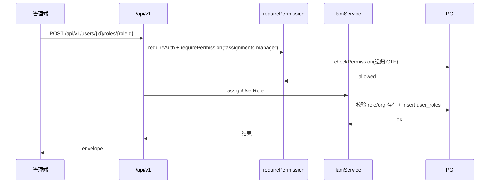

# Feature: iam（权限管理 + 用户身份）

## 1. Background

ADR-0004 决定权限层自建，读侧（schema / 递归 CTE 检查 / 目录同步 / 请求级 memoize）先行落地，但写侧（管理 API + bootstrap）缺失，导致权限数据无 API 入口，只能 seed/直连 DB。本 feature 补全写侧，让权限层对真实用户可用。

模板 day-0 完成度（成员子树、注册策略、`iam.manage` 拆三分、调岗等）见 [IAM 完成度 Checklist](../../checklists/iam-completeness-checklist.md)。

## 2. Goals

- `pnpm db:bootstrap` 引导第一个 admin（破鸡生蛋）。
- `/api/v1/me` 暴露当前用户身份与有效权限全集。
- 权限目录查询（代码同步，只读）。
- 角色 CRUD（实例角色，`source` 区分代码/实例）。
- 用户授权（授角色 / 直接授权 allow|deny / 撤销 / 查全集），支持组织 scope + 过期。
- 组织树 CRUD（防环）。
- 用户身份管理（管理员代创建 / 改资料 / 重置密码 / 禁用·启用），走自建业务端点（ADR-0007，不引 BA admin 插件）。

## 3. Non-goals

- 分级管理员（对目标 org 二次 manage 检查）。
- Redis 权限缓存 + 事件失效（第一版 ALS 请求级 memoize 足够）。
- 自定义角色之外的实例角色复杂策略；过期记录 housekeeping。
- audit log（关键写操作审计，独立 feature 推进）。
- 硬删除用户（用禁用替代，涉及权限/项目归属 cascade，延后）。
- 邮件验证 + 找回密码邮件（走管理员代重置，不发邮件；邮件基础设施延后）。
- 用户多组织 + 切换组织（保持单组织，`user.orgId` 不变）。

## 4. API Surface

| Method | Path | OperationId | Auth | Description |
| --- | --- | --- | --- | --- |
| GET | `/api/v1/me` | `getMe` | 认证 | 当前用户 + 有效权限全集 |
| GET | `/api/v1/permissions` | `listPermissions` | iam.read | 权限目录（只读） |
| GET | `/api/v1/roles` | `listRoles` | iam.read | 角色列表（含 source） |
| POST | `/api/v1/roles` | `createRole` | roles.manage | 建实例角色 |
| PATCH | `/api/v1/roles/{roleId}` | `updateRole` | roles.manage | 改实例角色 |
| DELETE | `/api/v1/roles/{roleId}` | `deleteRole` | roles.manage | 删实例角色（cascade） |
| GET | `/api/v1/roles/{roleId}/permissions` | `listRolePermissions` | iam.read | 角色含的权限 |
| POST | `/api/v1/roles/{roleId}/permissions` | `assignRolePermissions` | roles.manage | 给角色配权限 |
| DELETE | `/api/v1/roles/{roleId}/permissions/{permission}` | `deleteRolePermission` | roles.manage | 撤角色权限 |
| GET | `/api/v1/users` | `listUsers` | users.read | 列出管理子树(自身+子孙)下的用户 |
| POST | `/api/v1/users` | `createUser` | users.create | 管理员代创建用户（email+password+name+orgId，目标 org 须在管理子树内） |
| PATCH | `/api/v1/users/{userId}` | `updateUser` | users.update | 改用户资料（name/email，不改 orgId） |
| POST | `/api/v1/users/{userId}/reset-password` | `resetUserPassword` | users.reset-password | 重置密码（hashPassword+update account+删 session） |
| POST | `/api/v1/users/{userId}/disable` | `disableUser` | users.disable | 禁用用户（set disabled=true+删所有 session；禁止自禁用） |
| POST | `/api/v1/users/{userId}/enable` | `enableUser` | users.enable | 启用用户（清 disabled） |
| POST | `/api/v1/users/{userId}/roles/{roleId}` | `assignUserRole` | assignments.manage | 授用户角色 |
| DELETE | `/api/v1/users/{userId}/roles/{roleId}` | `deleteUserRole` | assignments.manage | 撤用户角色（query orgId） |
| POST | `/api/v1/users/{userId}/permissions/{permission}` | `assignUserPermission` | assignments.manage | 直接授权 allow/deny |
| DELETE | `/api/v1/users/{userId}/permissions/{permission}` | `deleteUserPermission` | assignments.manage | 撤直接权限（query orgId） |
| GET | `/api/v1/users/{userId}/permissions` | `listUserPermissions` | iam.read | 用户有效权限全集（query orgId，含祖先继承，CTE 计算） |
| GET | `/api/v1/users/{userId}/roles` | `listUserRoles` | iam.read | 用户在某组织已授的角色记录（query orgId，原始授权非继承，含 expiresAt，撤销用） |
| GET | `/api/v1/users/{userId}/direct-permissions` | `listUserDirectPermissions` | iam.read | 用户在某组织的直接授权记录（query orgId，原始授权非继承，含 effect/expiresAt，撤销用） |
| GET | `/api/v1/organizations` | `listOrganizations` | iam.read | 组织列表（扁平） |
| POST | `/api/v1/organizations` | `createOrganization` | organizations.manage | 建组织 |
| GET | `/api/v1/organizations/{orgId}` | `getOrganization` | iam.read | 组织详情 |
| PATCH | `/api/v1/organizations/{orgId}` | `updateOrganization` | organizations.manage | 改组织（防环） |
| DELETE | `/api/v1/organizations/{orgId}` | `deleteOrganization` | organizations.manage | 删组织（有子拒绝） |

## 5. Request / Response

统一 envelope（`success` / `code` / `data` / `error` / `meta.requestId`）。列表不分页（第一版全量返回，按 name/createdAt 确定性排序）。`DELETE` 撤销类用 query `orgId` 定位（user_roles/user_permissions PK 含 orgId）。

`listUserRoles` / `listUserDirectPermissions` 返回**原始授权记录**（`orgId` 直接相等，非祖先继承），供管理端撤销用；`listUserPermissions` 返回**有效权限全集**（含祖先继承 + deny 减法 + 过期过滤，CTE 计算）。两者职责区分：撤销看前者，展示"用户最终能干什么"看后者。两者查无记录返回空数组，不抛 404。

## 6. Auth & Permissions

`features/iam/permissions.ts` 声明 `iam.*`（组织/角色/授权）与细粒度 `users.*`（用户身份生命周期，对齐 projects.* 范式），展开到 `permissions-catalog.ts` 的 `allPermissions`。admin 角色（代码同步）含全部权限。

| Permission | Description |
| --- | --- |
| `iam.read` | 查看组织/角色/授权/权限目录 |
| `organizations.manage` | 管理组织（建/改/删） |
| `roles.manage` | 管理角色与角色权限挂载 |
| `assignments.manage` | 授/撤用户角色与直接权限 |
| `users.read` | 查看用户列表 |
| `users.create` | 代创建用户 |
| `users.update` | 修改用户资料 |
| `users.reset-password` | 重置用户密码 |
| `users.disable` | 禁用用户 |
| `users.enable` | 启用用户 |

第一版全局 admin：根组织 admin 因祖先遍历对任意子组织检查通过。`/api/v1/me` 仅需认证（看自己）。

### 管理范围(Home / 管理子树 / Grant org)

授权与管理沿三条组织轴(定义见 [authorization.md 组织三轴](../../conventions/backend/authorization.md)):

- **Home org**:`user.orgId`,管理员代建用户时取此值(当前不可选目标 org)。
- **管理子树**:管理员可写操作的范围 = 自身 + 子孙。`createUser`/`listUsers`/`updateUser`/`resetPassword`/`disable`/`enable`/`assignUserRole`/`assignUserPermission` 的目标组织与目标用户均须落在操作者管理子树内。
- **Grant org**:授角色/直接权限时绑定的组织节点,检查时祖先继承(向下传播)。

> 当前实现:`createUser`/`listUsers`/`update`/`reset`/`disable`/`enable`/`assignUserRole`/`assignUserPermission`/`deleteUserRole`/`deleteUserPermission`/`listUserPermissions`/`listUserRoles`/`listUserDirectPermissions` 均已按操作者管理子树(自身+子孙)校验(user 与 grant.orgId 双校验,读端点与写端点对称);重复授角色/权限时,提供 `expiresAt` 则更新(续期),省略则保留原过期时间(不清空),`effect` 总以新值为准。调岗(PATCH orgId)本期不做。

## 7. Data Model

- `roles`：加 `source` 列（`code` | `instance`，default `instance`）。`code` = 代码同步（admin），`instance` = 管理 API 创建。
- `role_permissions` / `user_roles` / `user_permissions`：授权关联，均带 orgId + 可选 expiresAt；外键 cascade。
- `organizations`：树形（parentId 自引用，CYCLE 兜底）。
- `permissions`：代码同步目录，管理 API 只读。
- `IamPermissionChecker`（`features/iam/permission-checker.ts`）：`PermissionChecker` 的本地 Adapter（PDP），实现 check/list-effective 的递归 CTE；不含 memoize（由 core `PermissionService` 装饰）。可整体替换为外部 PDP（见 [authorization.md 边界划分](../../conventions/backend/authorization.md)）。
- `user.disabled`：Better Auth additionalField（经 `auth:generate` 写入 auth-schema），`databaseHooks.session.create.before` 检查 disabled 阻止 session 创建（同时阻止登录和续期），禁用时主动删 session 立即下线。见 ADR-0007。

## 8. Error Codes

第一版复用 `COMMON_*`，不引入 `IAM_*` 专用码。

| Code | HTTP Status | Description |
| --- | --- | --- |
| `COMMON_NOT_FOUND` | 404 | 角色/组织/权限/授权不存在，或对 code 角色改删 |
| `COMMON_CONFLICT` | 409 | 角色名重复；组织形成环；删有子组织；用户邮箱重复 |
| `COMMON_FORBIDDEN` | 403 | 无对应权限；禁止禁用自己 |
| `AUTH_ACCOUNT_DISABLED` | 403 | 用户已禁用（`databaseHooks.session.create.before` 检查 disabled，阻止 session 创建） |
| `COMMON_UNAUTHORIZED` | 401 | 未认证 |

## 9. Request Flow

## 10. Logging & Audit

管理写操作走结构化日志（LogLayer，带 requestId）。userId 在 requireAuth 注入 Hono context（`c.set("userId")`），供 handler 读取；未注入 LogLayer 日志 context（Hono c.set 与 LogLayer withContext 类型不兼容，见 checklist §11）。关键写操作的 audit log 暂未实现（见 Non-goals）。

## 11. Test Cases

- unit：`features/iam/iam.test.ts`（路由全覆盖鉴权 403 + handler→service 接线 + 错误码 404/409 映射，含 users.* 用户管理）、`features/me/me.test.ts`
- integration：`tests/integration/authorization/iam-roles.test.ts`（source 保护、cascade）、`iam-assignments.test.ts`（授角色/deny/祖先/过期/撤销全语义）、`iam-organizations.test.ts`（建树/防环/删除约束）、`list-effective.test.ts`（全集算法）、`iam-users.test.ts`（代创建 409、reset 后旧密码失效、disable 拦登录 + enable 恢复、自禁用 403）

## 12. Rollout / Migration Notes

- migration `0003`：`roles` 加 `source` 列（default `instance`）。`sync.ts` 用 `onConflictDoUpdate` 强制 admin `source='code'`（修正旧库被 default 覆盖的情况）。
- migration `0004`：`user` 加 `disabled` 列（经 `auth:generate` 自动生成）；新建 `system_settings` 表。
- 部署顺序：`db:migrate` -> `db:bootstrap`（造第一个 admin）-> start（sync 同步目录 + admin 角色）。
- `bootstrap` 幂等：组织已存在跳过；admin email 已存在报错（不覆盖密码）。
- 用户管理端点复用 `bootstrap.ts` 原语（`hashPassword` from `better-auth/crypto` + `db.insert` user/account），不引 BA admin 插件（ADR-0007）。
