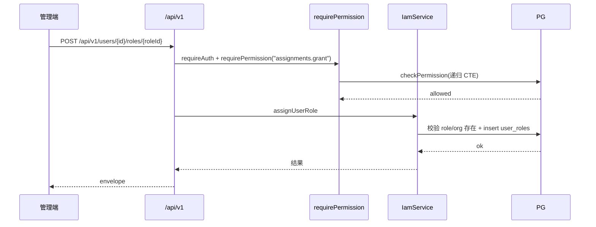

# Feature: iam（权限管理 + 用户身份）

## 1. Background

ADR-0004 决定权限层自建，读侧（schema / 递归 CTE 检查 / 目录同步 / 请求级 memoize）先行落地，但写侧（管理 API + bootstrap）缺失，导致权限数据无 API 入口，只能 seed/直连 DB。本 feature 补全写侧，让权限层对真实用户可用。

模板 day-0 完成度（成员子树、注册策略、`iam.manage` 拆三分、调岗等）见 [IAM 完成度 Checklist](../../checklists/iam-completeness-checklist.md)。

## 2. Goals

- `pnpm db:bootstrap` 引导第一个 admin（破鸡生蛋）。
- `/api/v1/me` 暴露当前用户身份与有效权限全集。
- 权限目录查询（代码同步，只读）。
- 角色 CRUD（实例角色，`source` 区分代码/实例）。
- 用户授权（授角色 / 直接授权 allow|deny / 撤销 / 查全集），支持组织 scope + 过期。
- 组织树 CRUD（防环）。
- 用户身份管理（管理员代创建 / 改资料 / 重置密码 / 禁用·启用），走自建业务端点（ADR-0007，不引 BA admin 插件）。

## 3. Non-goals

- 分级管理员（对目标 org 二次 manage 检查）。
- Redis 权限缓存 + 事件失效（第一版 ALS 请求级 memoize 足够）。
- 自定义角色之外的实例角色复杂策略；过期记录 housekeeping。
- 硬删除用户（用禁用替代，涉及权限/项目归属 cascade，延后）。
- 邮件验证 + 找回密码邮件（走管理员代重置，不发邮件；邮件基础设施延后）。
- 用户多组织 + 切换组织（保持单组织，`user.orgId` 不变）。

## 4. API Surface

| Method | Path | OperationId | Auth | Description |
| --- | --- | --- | --- | --- |
| GET | `/api/v1/me` | `getMe` | 认证 | 当前用户 + 有效 `permissionCodes` |
| PATCH | `/api/v1/me` | `updateMe` | 认证 | 自助修改显示名(不改 email/orgId/disabled) |
| POST | `/api/v1/me/password` | `changeMyPassword` | 认证 | 自助改密码(验当前密码 → 删全部 session,强制重登) |
| GET | `/api/v1/permissions` | `listPermissions` | permissions.read | 权限目录（只读） |
| GET | `/api/v1/roles` | `listRoles` | roles.read | 角色列表（含 source） |
| POST | `/api/v1/roles` | `createRole` | roles.create | 建实例角色 |
| PATCH | `/api/v1/roles/{roleId}` | `updateRole` | roles.update | 改实例角色 |
| DELETE | `/api/v1/roles/{roleId}` | `deleteRole` | roles.delete | 删实例角色（cascade） |
| GET | `/api/v1/roles/{roleId}/permissions` | `listRolePermissions` | roles.read | 角色含的权限 |
| POST | `/api/v1/roles/{roleId}/permissions` | `assignRolePermissions` | roles.assign-permissions | 给角色配权限 |
| PATCH | `/api/v1/roles/{roleId}/permissions` | `updateRolePermissions` | 按新增/撤销差量分别校验 `roles.assign-permissions` / `roles.revoke-permissions` | 原子批量新增和撤销角色权限 |
| DELETE | `/api/v1/roles/{roleId}/permissions/{permissionCode}` | `deleteRolePermission` | roles.revoke-permissions | 撤角色权限 |
| GET | `/api/v1/roles/{roleId}/users` | `listRoleUsers` | assignments.read | 角色已授用户（管理子树内，含 orgId/expiresAt） |
| GET | `/api/v1/users` | `listUsers` | users.read | 列出管理子树(自身+子孙)下的用户 |
| POST | `/api/v1/users` | `createUser` | users.create | 管理员代创建用户（email+password+name+orgId，目标 org 须在管理子树内） |
| PATCH | `/api/v1/users/{userId}` | `updateUser` | users.update | 改用户资料(name/email,不改 orgId) |
| PATCH | `/api/v1/users/{userId}/organization` | `transferUserOrganization` | users.update | 调岗(改 orgId + grant 清理) |
| POST | `/api/v1/users/{userId}/reset-password` | `resetUserPassword` | users.reset-password | 重置密码（hashPassword+update account+删 session） |
| POST | `/api/v1/users/{userId}/disable` | `disableUser` | users.disable | 禁用用户（set disabled=true+删所有 session；禁止自禁用） |
| POST | `/api/v1/users/{userId}/enable` | `enableUser` | users.enable | 启用用户（清 disabled） |
| POST | `/api/v1/users/{userId}/roles/{roleId}` | `assignUserRole` | assignments.grant | 授用户角色 |
| DELETE | `/api/v1/users/{userId}/roles/{roleId}` | `deleteUserRole` | assignments.revoke | 撤用户角色（query orgId） |
| POST | `/api/v1/users/{userId}/permissions/{permissionCode}` | `assignUserPermission` | assignments.grant | 直接授权 allow/deny |
| DELETE | `/api/v1/users/{userId}/permissions/{permissionCode}` | `deleteUserPermission` | assignments.revoke | 撤直接权限（query orgId） |
| GET | `/api/v1/users/{userId}/permissions` | `listUserPermissions` | assignments.read | 用户有效权限全集（query orgId，含祖先继承 + deny 减法，带来源链，CTE 计算） |
| GET | `/api/v1/users/{userId}/roles` | `listUserRoles` | assignments.read | 用户在某组织已授的角色记录（query orgId，原始授权非继承，含 expiresAt，撤销用） |
| GET | `/api/v1/users/{userId}/direct-permissions` | `listUserDirectPermissions` | assignments.read | 用户在某组织的直接授权记录（query orgId，原始授权非继承，含 effect/expiresAt，撤销用） |
| GET | `/api/v1/organizations` | `listOrganizations` | organizations.read | 组织列表（扁平） |
| POST | `/api/v1/organizations` | `createOrganization` | organizations.create | 建组织 |
| GET | `/api/v1/organizations/{orgId}` | `getOrganization` | organizations.read | 组织详情 |
| PATCH | `/api/v1/organizations/{orgId}` | `updateOrganization` | organizations.update | 改组织（防环） |
| DELETE | `/api/v1/organizations/{orgId}` | `deleteOrganization` | organizations.delete | 删组织（有子或有用户拒绝） |

## 5. Request / Response

统一 envelope（`success` / `code` / `data` / `error` / `meta.requestId`）。列表不分页（第一版全量返回，按 name/createdAt 确定性排序）。`DELETE` 撤销类用 query `orgId` 定位（user_roles/user_permissions PK 含 orgId）。

权限契约统一使用机器 code：字符串身份字段命名为 `permissionCode`，字符串数组命名为 `permissionCodes`，批量角色授权 body 为 `{ permissionCodes }`；角色权限差量更新 body 为 `{ addPermissionCodes, removePermissionCodes }`，两个数组不可交叉。`GET /api/v1/permissions`、角色权限列表返回 `PermissionRef[]`；有效权限、deny 和直接授权记录使用 `permission: PermissionRef`。`/api/v1/me` 只返回 `permissionCodes`，不把展示 label 混入授权身份。已知权限输入由 catalog 派生的 OpenAPI enum 约束，HTTP 未知 code 返回 `400/PERMISSION_CODE_INVALID`，service 或同步阶段发现内部未知 code 则使用 `PERMISSION_NOT_FOUND` 或启动失败。角色权限差量更新在同一事务中完成，失败不留下部分新增或撤销。

`listUserRoles` / `listUserDirectPermissions` 返回**原始授权记录**（`orgId` 直接相等，非祖先继承），供管理端撤销用；`listUserPermissions` 返回**有效权限全集 + 来源链**（含祖先继承 + deny 减法 + 过期过滤，CTE 计算；每条权限带来源 `{type, roleId, roleName, orgId, expiresAt}`，被 deny 抵消的单独列 `denied` 带 `suppressedSources` + `deniedBy`）。`listRoleUsers` 返回管理子树内授了某角色的 `(user, org)` 记录（供角色详情展示影响面）。撤销看原始授权记录，展示"用户最终能干什么 + 从哪来"看有效权限全集，看"改角色影响谁"看 `listRoleUsers`。三者查无记录返回空数组/空对象，不抛 404。

## 6. Auth & Permissions

`features/iam/permissions.ts` 使用 `definePermissionCatalog()` 声明权限目录、组织、角色、授权与用户身份管理的细粒度权限，展开到 `catalogs/permissions.ts` 的 `allPermissions`。admin 角色（代码同步）含全部权限；label 只属于 catalog/presenter，不属于授权检查或 DB。

| Permission | Description |
| --- | --- |
| `permissions.read` | 查看权限目录 |
| `roles.read` | 查看角色 |
| `organizations.read` | 查看组织 |
| `assignments.read` | 查看用户授权 |
| `organizations.create` | 创建组织 |
| `organizations.update` | 修改组织 |
| `organizations.delete` | 删除组织 |
| `roles.create` | 创建角色 |
| `roles.update` | 修改角色 |
| `roles.delete` | 删除角色 |
| `roles.assign-permissions` | 给角色分配权限 |
| `roles.revoke-permissions` | 撤销角色权限 |
| `assignments.grant` | 授予用户角色或直接权限 |
| `assignments.revoke` | 撤销用户角色或直接权限 |
| `users.read` | 查看用户列表 |
| `users.create` | 代创建用户 |
| `users.update` | 修改用户资料 |
| `users.reset-password` | 重置用户密码 |
| `users.disable` | 禁用用户 |
| `users.enable` | 启用用户 |

第一版全局 admin：根组织 admin 因祖先遍历对任意子组织检查通过。`/api/v1/me` 仅需认证（看自己）。

### 管理范围(Home / 管理子树 / Grant org)

授权与管理沿三条组织轴(定义见 [authorization.md 组织三轴](../../conventions/backend/authorization.md)):

- **Home org**:`user.orgId`,管理员代建用户时选定(须在管理子树内)。
- **管理子树**:管理员可写操作的范围 = 自身 + 子孙。`createUser`/`listUsers`/`updateUser`/`resetPassword`/`disable`/`enable`/`assignUserRole`/`assignUserPermission` 的目标组织与目标用户均须落在操作者管理子树内。
- **Grant org**:授角色/直接权限时绑定的组织节点,检查时祖先继承(向下传播)。

> 当前实现:`createUser`/`listUsers`/`update`/`reset`/`disable`/`enable`/`assignUserRole`/`assignUserPermission`/`deleteUserRole`/`deleteUserPermission`/`listUserPermissions`/`listUserRoles`/`listUserDirectPermissions`/`listRoleUsers` 均已按操作者管理子树(自身+子孙)校验(user 与 grant.orgId 双校验,读端点与写端点对称);重复授角色/权限时,提供 `expiresAt` 则更新(续期),省略则保留原过期时间(不清空),`effect` 总以新值为准。调岗(`transferUserOrganization`)改 `user.orgId` 到管理子树内的新 org,并在同事务内清理失效 grant(方案 A:删 staleOrgIds = 旧 home 祖先集 − 新 home 祖先集 上的 `user_roles`/`user_permissions`,共同祖先 grant 保留;`clearAllGrants=true` 清全部 grant);调岗后权限检查沿新 home 向上查祖先集,旧独有路径 grant 算法层面自动失效,清理是数据卫生;禁止调岗自己(防把自己调出管理子树锁死);乐观锁 `UPDATE WHERE orgId = oldOrgId`,并发后写者 409。`user.orgId` 由 `NOT NULL` + `ON DELETE RESTRICT` 外键保证 home org 必然存在；创建用户和调岗先对目标组织取 `FOR KEY SHARE`，删除组织先取 `FOR UPDATE` 再检查子组织与用户，因此并发竞争稳定返回 `ORG_NOT_FOUND`/`ORG_HAS_USERS`，不会产生孤儿用户或暴露裸 PostgreSQL 错误。`deleteUserRole`/`deleteUserPermission` 禁止对自己操作(防自我降级锁死,对齐 `disableUser`);`assignUserRole`/`assignUserPermission` 不限(授予不锁死)。所有写路径(`createUser`/`updateUser`/`resetPassword`/`disableUser`/`transferUserOrganization`/`createRole`/`updateRole`/`assignRolePermissions`/`updateOrganization`)均用 `db.transaction` 包多步写 + 冲突显式抛 `AppError`(照 `createUser` 范本,B2),不依赖 PG 错误冒泡兜底。
>
> **组织操作的全局 admin 边界**：`listOrganizations`/`createOrganization`/`updateOrganization`/`deleteOrganization` 当前不按管理子树过滤/校验。第一版全局 admin 模型下，`organizations.*` 与 `organizations.read` 仅根 admin 持有，根 admin 子树=全树，故无越权。分级管理员（§3 Non-goal）落地时，需为组织写操作补子树校验、为 `listOrganizations` 补子树过滤；在此之前组织 list/写操作仅全局 admin 可用（checklist §6/§7）。

## 7. Data Model

- `roles`：加 `source` 列（`code` | `instance`，default `instance`）。`code` = 代码同步（admin），`instance` = 管理 API 创建。
- `permissions`：code-only registry，只有 `code` 主键；`role_permissions.permission_code` 和 `user_permissions.permission_code` 外键使用 `ON DELETE RESTRICT`。
- `role_permissions` / `user_roles` / `user_permissions`：授权关联，均带 orgId + 可选 expiresAt；角色/组织/用户关系仍按原有语义 cascade，权限 code 不级联删除。
- `organizations`：树形（parentId 自引用，CYCLE 兜底）。
- `user.orgId`：非空 home org，外键 `ON DELETE RESTRICT` 指向 `organizations.id` 并建立 `user_org_id_idx`；组织定义独立在 `organization-schema.ts`，认证 schema 与授权 schema 单向依赖它。
- `IamPermissionChecker`（`features/iam/permission-checker.ts`）：`PermissionChecker` 的本地 Adapter（PDP），实现 check（单点 EXISTS CTE）/ listEffectivePermissions（带来源链的递归 CTE：grant_sources UNION deny_set，JOIN roles 拿 role_name，祖先集 + 过期过滤）；不含 memoize（由 core `PermissionService` 装饰，me 与 listUserPermissions 路由共享缓存）。可整体替换为外部 PDP（见 [authorization.md 边界划分](../../conventions/backend/authorization.md)）。
- `user.disabled`：Better Auth additionalField（由应用正式 `auth-schema.ts` 维护，CLI 生成物仅作升级参考），`databaseHooks.session.create.before` 检查 disabled 阻止 session 创建（阻止登录但不负责 session update 续期），禁用时主动删 session 立即下线（未开 cookieCache，删行即失效）。见 ADR-0007。`disableUser`/`resetPassword` 的 update 标记/密码 + delete session 在同一 `db.transaction` 内，保证原子（任一失败回滚，避免"disabled=true 但旧 session 仍有效"的安全语义破坏，B2 D1）。

## 8. Error Codes

权限输入与不存在错误使用通用权限业务码，其余 IAM 业务错误继续复用已有错误码。

| Code | HTTP Status | Description |
| --- | --- | --- |
| `PERMISSION_NOT_FOUND` | 404 | catalog/registry 中不存在指定权限 code |
| `PERMISSION_CODE_INVALID` | 400 | HTTP 输入不属于 catalog enum |
| `COMMON_NOT_FOUND` | 404 | 角色/组织/授权不存在,或对 code 角色改删 |
| `COMMON_CONFLICT` | 409 | 角色名重复;组织形成环;删有子组织或有用户的组织;用户邮箱重复 |
| `COMMON_FORBIDDEN` | 403 | 无对应权限;禁止禁用自己 |
| `AUTH_ACCOUNT_DISABLED` | 403 | 用户已禁用(`databaseHooks.session.create.before` 检查 disabled,阻止 session 创建) |
| `COMMON_UNAUTHORIZED` | 401 | 未认证 |
| `ORG_SAME_AS_CURRENT` | 409 | 调岗目标组织与当前相同 |
| `USER_CANNOT_TRANSFER_SELF` | 403 | 禁止调岗自己 |
| `USER_TRANSFER_CONFLICT` | 409 | 调岗乐观锁冲突(用户组织已被并发修改) |
| `USER_INVALID_PASSWORD` | 401 | 自助改密码时当前密码错误 |

## 9. Request Flow

```mermaid
sequenceDiagram
  participant Client as 管理端
  participant API as /api/v1
  participant Auth as requirePermission
  participant Service as IamService
  participant DB as PG

  Client->>API: POST /api/v1/users/{id}/roles/{roleId}
  API->>Auth: requireAuth + requirePermission("assignments.grant")
  Auth->>DB: checkPermission(递归 CTE)
  DB-->>Auth: allowed
  API->>Service: assignUserRole
  Service->>DB: 校验 role/org 存在 + insert user_roles
  DB-->>Service: ok
  Service-->>API: 结果
  API-->>Client: envelope
```

## 10. Logging & Audit

管理写操作走结构化日志（LogLayer，带 requestId）。userId 由 requireAuth 认证成功后用 `c.var.logger.getContextManager().appendContext({ userId })` 注入请求级 logger context（业务日志与 access log 均带 userId；appendContext 绕开 withContext 的 `ts/no-unsafe-argument` 误报，见 logging-loglayer.md）。

全部 18 个写路由已接入审计日志（`audit()` 中间件声明式接入，含 before 快照与 metadata），见 [backend audit feature 文档](../backend/audit.md) 与 ADR-0009。

## 11. Test Cases

- unit：`core/auth/permissions.test.ts`（builder 字段、格式与 label 校验）、`catalogs/permissions.test.ts`（唯一性与 registry 覆盖）、`core/app/create-router.test.ts`（未知 code 400）、`features/iam/iam.test.ts`（路由鉴权 + 新字段接线）、`features/me/me.test.ts`
- integration：`tests/integration/authorization/sync.test.ts`（code-only registry、stale code 清理/有引用失败、admin 同步）、`iam-roles.test.ts`（source 保护、cascade、listRoleUsers 子树过滤）、`iam-assignments.test.ts`（授角色/deny/祖先/过期/撤销全语义）、`iam-organizations.test.ts`（建树/防环/删除约束）、`list-effective.test.ts`（全集算法 + 来源链 + deny 抵消 + 多来源聚合）、`iam-users.test.ts`（代创建 409、reset 后旧密码失效、disable 拦登录 + enable 恢复、自禁用 403）

## 12. Rollout / Migration Notes

- migration `0003`：`roles` 加 `source` 列（default `instance`）。`sync.ts` 用 `onConflictDoUpdate` 强制 admin `source='code'`（修正旧库被 default 覆盖的情况）。
- migration `0004`：`user` 加 `disabled` 列（历史上由 Better Auth CLI 生成）；新建 `system_settings` 表。当前正式认证 schema 已改由应用维护（ADR-0012）。
- migration `0009_permission_contract_cleanup`：`permissions` 收敛为 code-only；关联列改名为 `permission_code`，权限外键改为 `ON DELETE RESTRICT`。不修改旧 migration，不做双读/双写或历史数据回填。
- migration `0010_striped_smasher`：仅将 `user.org_id` 设为 `NOT NULL`、增加 `user_org_id_organizations_id_fk` 和 `user_org_id_idx`；greenfield 边界下不回填 null 或悬空数据。
- 部署顺序：`db:migrate` -> `db:bootstrap`（造第一个 admin）-> start（sync 同步目录 + admin 角色）。
- `commands/bootstrap-admin.ts` 幂等：组织已存在跳过；admin email 已存在报错（不覆盖密码）；首个 user/account/admin grant 在同一事务中，失败不留下半成品账号。
- 用户管理端点复用 bootstrap 原语（`hashPassword` from `better-auth/crypto` + `db.insert` user/account），不引 BA admin 插件（ADR-0007）。
