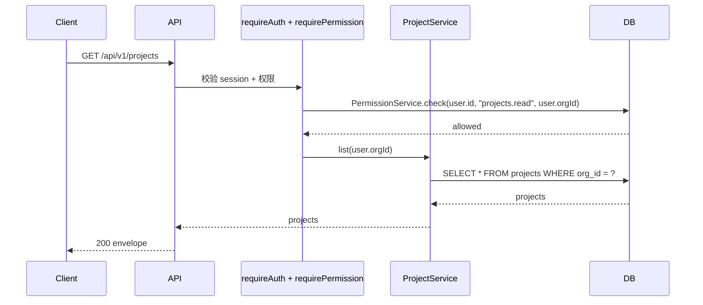

# Feature: projects

## 1. Background

第一个业务 feature,验证权限层端到端(`requireAuth + requirePermission`),建立中等 feature 模板。完整 CRUD:list / detail / create / update / delete,作为后续业务 feature 的标准范式样板。

## 2. Goals

- 验证权限层在真实 feature 的使用体验
- 建立中等 feature(handler + service + permissions + 写操作)模板
- 跑通 `requirePermission` 对多个细粒度写权限(projects.read/create/update/delete)的端到端链路
- 验证写操作的归属 scope(只操作本组织项目)与同组织重名软校验

## 3. Non-goals

- 跨组织项目查询(祖先/子组织 scope)
- 权限管理 API(organizations/roles CRUD,属 iam feature)
- 软删除(直接物理删,与 org cascade 一致)
- audit log(关键写操作审计,独立 feature 推进)

## 4. API Surface

| Method | Path | OperationId | Auth | Description |
| --- | --- | --- | --- | --- |
| GET | `/api/v1/projects` | `listProjects` | projects.read | 列出当前用户组织下的项目 |
| GET | `/api/v1/projects/{projectId}` | `getProjectById` | projects.read | 项目详情(不属于当前组织返回 404) |
| POST | `/api/v1/projects` | `createProject` | projects.create | 创建项目(同组织内名称唯一) |
| PATCH | `/api/v1/projects/{projectId}` | `updateProject` | projects.update | 修改项目(不属于当前组织返回 404) |
| DELETE | `/api/v1/projects/{projectId}` | `deleteProject` | projects.delete | 删除项目(不属于当前组织返回 404) |

## 5. Request / Response

统一 envelope(`success` / `code` / `data` / `error` / `meta.requestId`)。列表不分页(全量返回,按 createdAt、id 确定性排序)。

- list:无 request body,响应 `Project[]`
- detail:path param `projectId`,响应 `Project`
- create:body `{ name: string, description?: string }`,响应 `Project`
- update:body `{ name?: string, description?: string | null }`(`description` 传 null 清空,全部可选),响应 `Project`
- delete:响应 `{ id: string }`

`Project` schema:`id`、`name`、`description`(nullable)、`orgId`、`createdAt`、`updatedAt`(ISO 8601)。

## 6. Auth & Permissions

| Permission | Description |
| --- | --- |
| `projects.read` | 查看项目(list / detail) |
| `projects.create` | 创建项目 |
| `projects.update` | 修改项目 |
| `projects.delete` | 删除项目 |

权限在 `features/projects/permissions.ts` 用 `as const satisfies` 声明权限数组,由 `permissions-catalog.ts` 汇总为 `allPermissions`(`AppPermission` 从它推导)。

- `requireAuth()` 校验 Better Auth session,注入 `user`
- `requirePermission("<perm>")` 检查用户在 `user.orgId` 是否有对应权限(考虑组织树祖先继承)
- `orgId` 默认 `user.orgId`(用户归属组织)
- 读/写权限分离:读路由用 `projects.read`,三条写路由分别用 `projects.create` / `update` / `delete`,最小权限粒度

写操作归属 scope:service 层所有写方法只作用于 `orgId` 本组织项目;跨组织一律 `COMMON_NOT_FOUND`(不泄露存在性)。同组织内 `name` 唯一,service 层软校验(抛 `COMMON_CONFLICT`),不加 DB unique 约束,与 iam `createRole` 风格一致;不同组织允许重名。

## 7. Data Model

`projects` 表:

| 列 | 类型 | 约束 |
| --- | --- | --- |
| id | text | PK |
| name | text | NOT NULL |
| description | text | nullable |
| org_id | text | NOT NULL, FK -> organizations.id ON DELETE cascade |
| created_at | timestamptz | DEFAULT now() NOT NULL |
| updated_at | timestamptz | DEFAULT now() NOT NULL(`$onUpdate` 自动刷新) |

索引:`org_id`(按组织查询)。migration `0002_gifted_marten_broadcloak.sql`。CRUD 复用现有表结构,无需新 migration。

## 8. Error Codes

复用通用错误码,无 feature 专属错误码:

| Code | HTTP Status | Description |
| --- | --- | --- |
| `COMMON_UNAUTHORIZED` | 401 | 未认证 |
| `COMMON_FORBIDDEN` | 403 | 无权限或无组织 |
| `COMMON_NOT_FOUND` | 404 | 项目不存在或不属于当前组织 |
| `COMMON_CONFLICT` | 409 | 同组织内项目名重复(create / 改名 update) |

## 9. Request Flow

写操作(create / update / delete)流程同构:中间件换为对应 `projects.create` / `update` / `delete` 权限,service 层在数据访问前做归属 scope 校验(跨组织 NOT_FOUND)与重名校验(同组织 CONFLICT),`updatedAt` 由 schema `$onUpdate` 在 update 时自动刷新。

## 10. Logging & Audit

写操作走结构化日志(LogLayer,带 requestId)。访问日志由 `honoLogLayer` 全局记录(requestId + status)。关键写操作的 audit log 暂未实现(见 Non-goals,独立 feature 推进)。

## 11. Test Cases

- unit(`projects.test.ts`,route test,mock ProjectService):
  - list:无 session -> 401 / 无权限 -> 403 / 有权限 -> 200 envelope
  - detail:不存在 -> 404 / 存在 -> 200 envelope
  - create:401 / 403 / 200(断言按 orgId 调 service)/ 409(重名)
  - update:403 / 200(断言按 id+orgId+body 调 service)/ 404 / 409(重名)
  - delete:403 / 200(断言按 id+orgId 调 service)/ 404
- integration(`tests/integration/projects/projects.test.ts`,真实 PG / testcontainers):
  - create:落库 orgId 正确 / 同组织重名 CONFLICT / 不同组织同名 OK
  - update:改名与清空 description / 空 body 原样返回 / 改重名 CONFLICT / 跨组织 NOT_FOUND(归属隔离)/ updatedAt 自动刷新
  - delete:删除后查不到 / 跨组织 NOT_FOUND 且未删除
  - list:按 orgId scope 只返回本组织项目

## 12. Rollout / Migration Notes

- migration `0002_gifted_marten_broadcloak.sql`:新建 `projects` 表 + `org_id` 索引 + FK(已有,CRUD 复用,无需新 migration)
- 权限目录(`projects.read` / `create` / `update` / `delete`)+ 标准 `admin` 角色:app 启动时 `syncAuthorizationCatalog` 从代码自动同步,无需 seed
- 部署顺序不变:`db:migrate` -> `db:bootstrap`(造第一个 admin)-> start(sync 同步目录 + admin 角色)
- 开发环境:`pnpm db:seed` 造 dev 用户(授 admin 角色)+ 样例项目,端到端验证(登录 -> CRUD 200 / 重名 409 / 跨组织 404)
- 生产:组织/用户/授权等实例数据走管理 API + 一次性 bootstrap,seed 不进生产
