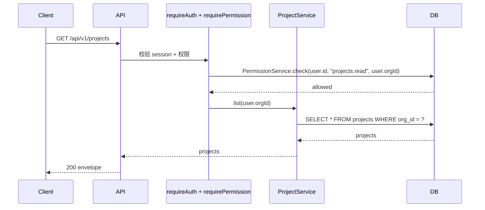

# Feature: projects(只读)

## 1. Background

第一个业务 feature,验证权限层端到端(`requireAuth + requirePermission`),建立中等 feature 模板。只读:list + detail。create/update/delete 后续扩展。

## 2. Goals

- 验证权限层在真实 feature 的使用体验
- 建立中等 feature(handler + service + permissions)模板
- 跑通 `requirePermission("projects.read")` 端到端链路

## 3. Non-goals

- create/update/delete(后续扩展)
- 跨组织项目查询(祖先/子组织 scope)
- 权限管理 API(organizations/roles CRUD)

## 4. API Surface

| Method | Path | OperationId | Auth | Description |
| --- | --- | --- | --- | --- |
| GET | `/api/v1/projects` | `listProjects` | yes | 列出当前用户组织下的项目 |
| GET | `/api/v1/projects/{projectId}` | `getProjectById` | yes | 项目详情(不属于当前组织返回 404) |

## 5. Request / Response

- list:无 request body,响应 `Project[]`
- detail:path param `projectId`,响应 `Project`

`Project` schema:`id`、`name`、`description`(nullable)、`orgId`、`createdAt`、`updatedAt`(ISO 8601)。

## 6. Auth & Permissions

| Permission | Description |
| --- | --- |
| `projects.read` | 查看项目 |

权限在 `features/projects/permissions.ts` 用 `as const satisfies` 声明权限数组,由 `permissions-manifest.ts` 汇总为 `APP_PERMISSIONS`(`AppPermission` 从它推导)。

- `requireAuth()` 校验 Better Auth session,注入 `user`
- `requirePermission("projects.read")` 检查用户在 `user.orgId` 是否有 `projects.read`(考虑组织树祖先继承)
- `orgId` 默认 `user.orgId`(用户归属组织)

## 7. Data Model

`projects` 表:

| 列 | 类型 | 约束 |
| --- | --- | --- |
| id | text | PK |
| name | text | NOT NULL |
| description | text | nullable |
| org_id | text | NOT NULL, FK → organizations.id ON DELETE cascade |
| created_at | timestamptz | DEFAULT now() NOT NULL |
| updated_at | timestamptz | DEFAULT now() NOT NULL |

索引:`org_id`(按组织查询)。migration `0002_gifted_marten_broadcloak.sql`。

## 8. Error Codes

复用通用错误码,无 feature 专属错误码:

| Code | HTTP Status | Description |
| --- | --- | --- |
| `COMMON_UNAUTHORIZED` | 401 | 未认证 |
| `COMMON_FORBIDDEN` | 403 | 无权限或无组织 |
| `COMMON_NOT_FOUND` | 404 | 项目不存在或不属于当前组织 |

## 9. Request Flow

## 10. Logging & Audit

只读 feature,无写操作,无 audit log。访问日志由 `honoLogLayer` 全局记录(requestId + status)。

## 11. Test Cases

- unit(`projects.test.ts`,route test):
  - 无 session → 401
  - 有 session 无权限 → 403
  - 有权限 → 200,返回 list envelope
  - detail 不存在 → 404
  - detail 存在 → 200,返回 project envelope
- integration:暂无(后续可加 `tests/integration/projects/projects.test.ts`,真实 db 查询)

## 12. Rollout / Migration Notes

- migration `0002_gifted_marten_broadcloak.sql`:新建 `projects` 表 + `org_id` 索引 + FK
- 权限目录(`projects.read`)+ 标准 `admin` 角色:app 启动时 `syncAuthorizationCatalog` 从代码自动同步,无需 seed
- 开发环境:`pnpm db:seed` 造 dev 用户(授 admin 角色)+ 样例项目,端到端验证(登录 -> `GET /api/v1/projects` 200)
- 生产:组织/用户/授权等实例数据走管理 API(未来)+ 一次性 bootstrap,seed 不进生产
- 后续 create/update/delete 扩展时再加 migration(如需新列)
