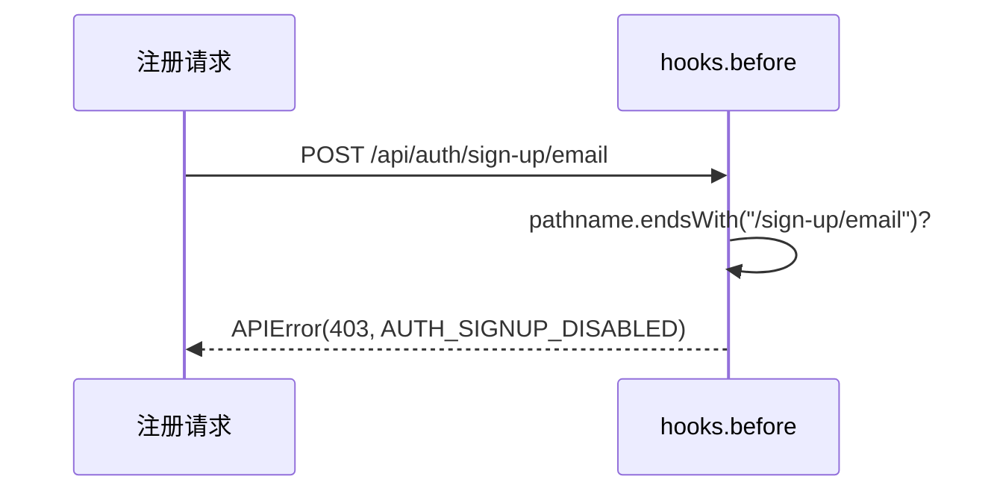

# Feature: system-settings（系统配置）

## 1. Background

系统需要部分配置在运行时可编辑（管理员通过 UI 修改），不再依赖改 env 重启。ADR-0007 决定用 DB `system_settings` 表存运行时配置 + Better Auth `hooks.before`。

**signUp 注册开关已退役**：模板移除自助注册（见 ADR-0007 superseded 注记），`hooks.before` 改为永久拒绝 `/sign-up/email`（不查 DB）。`system_settings` 表与 API 保留，供后续新增运行时配置；当前 registry 无内置 key。

## 2. Goals

- `system_settings` 表存储运行时可编辑配置（key-value JSON 模式）。
- `GET/PATCH /api/v1/settings` 提供配置读写 API（settings.read/settings.update 权限）。
- sign-up 永久拒绝：`hooks.before` 命中 `/sign-up/email` 一律抛 APIError（不依赖 DB）。

## 3. Non-goals

- 所有 env 配置搬进 DB（env 只留启动必需且不可热改的基础设施配置）。
- 配置变更审计 log（独立 feature 推进）。
- 配置变更通知/事件（单实例部署，无需事件总线）。
- 恢复自助注册（模板决策：不提供）。

## 4. API Surface

| Method | Path | OperationId | Auth | Description |
| --- | --- | --- | --- | --- |
| GET | `/api/v1/settings` | `listSettings` | settings.read | 列出全部配置（当前 registry 空，返回空数组） |
| PATCH | `/api/v1/settings/{key}` | `updateSetting` | settings.update | upsert 一条配置（当前 registry 空，任意 key 400） |

sign-up 拦截在 `better-auth.ts` 的 `hooks.before` 配置里声明：BA 用户级 hook 对所有 `/api/auth/*` 触发、无路径 matcher；用 `ctx.request?.url` 解析后 `new URL(url).pathname.endsWith("/sign-up/email")` 判断端点（pathname 去 query/fragment，防 `?foo` 绕过），命中即抛 `APIError`（`AUTH_SIGNUP_DISABLED`），**不查 DB**。不暴露独立端点。

## 5. Request / Response

统一 envelope。`PATCH /settings/{key}` body 为 `{ value: <json> }`，upsert 语义（不存在则创建）。`GET /settings` 返回全部配置数组（仅含 value 符合 registry schema 的行，脏数据降级过滤；当前 registry 空，返回空）。

## 6. Auth & Permissions

`features/system-settings/permissions.ts` 声明 `settings.read` / `settings.update`，展开到 `permissions-catalog.ts`。

| Permission | Description |
| --- | --- |
| `settings.read` | 查看系统设置 |
| `settings.update` | 修改系统设置 |

## 7. Data Model

- `system_settings`：`key` text PK（配置名）、`value` jsonb notNull（JSON）、`updatedAt` timestamptz、`updatedByUserId` text ->user onDelete set null（审计）。无 id/createdAt（key 天然主键）。
- registry 当前空：`settingRegistry`（`schemas.ts`）无内置 key。后续新增配置在此加 `key -> { valueSchema, description }`，schema 自动派生（类型/运行时/OpenAPI 同源，与 AppPermissionRegistry 范式同构）。空 registry 时 `z.union`/`z.enum` 用 refine 容错（空数组会 throw）：list 返回空，update 任意 key 400。

## 8. Error Codes

| Code | HTTP Status | Description |
| --- | --- | --- |
| `COMMON_FORBIDDEN` | 403 | 无 settings.read/settings.update |
| `COMMON_UNAUTHORIZED` | 401 | 未认证 |
| `AUTH_SIGNUP_DISABLED` | 403 | 不支持自助注册（`hooks.before` 永久拒绝 /sign-up/email） |

## 9. Request Flow

sign-up 拒绝流程（Better Auth `hooks.before`，不经 requirePermission，不查 DB）：

## 10. Logging & Audit

配置变更走结构化日志（LogLayer，带 requestId + userId）。audit log 暂未实现（见 Non-goals）。

## 11. Test Cases

- unit：`features/system-settings/system-settings.test.ts`（list 鉴权 401/403 + 接线；update 无权限 403 + registry 空任意 key 400）
- integration：`tests/integration/system-settings/settings.test.ts`（sign-up 任意 body 恒 403 + 带 query 403；`SystemSettingService.list` 空与脏数据过滤）

## 12. Rollout / Migration Notes

- migration `0004`：新建 `system_settings` 表。
- `signUp` key 退役：registry 移除 signUp，seed 不再写入。已有 DB 的 signUp 行属脏数据（list 过滤不返回），可手动清理或保留无害。
- `env.DISABLE_SIGN_UP` 已移除（ADR-0007）；sign-up 现由 `hooks.before` 永久拒绝，不依赖 DB。
- 配置 key 命名约定：camelCase，value 用 JSON 对象便于扩展字段。
