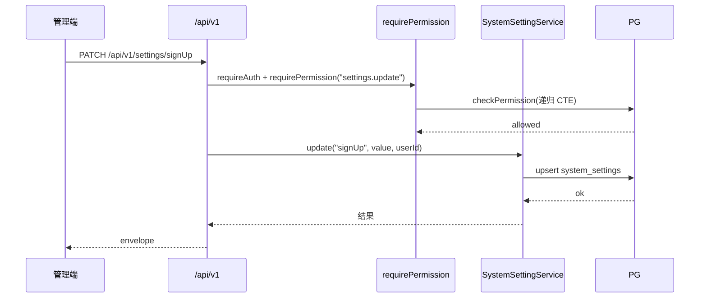
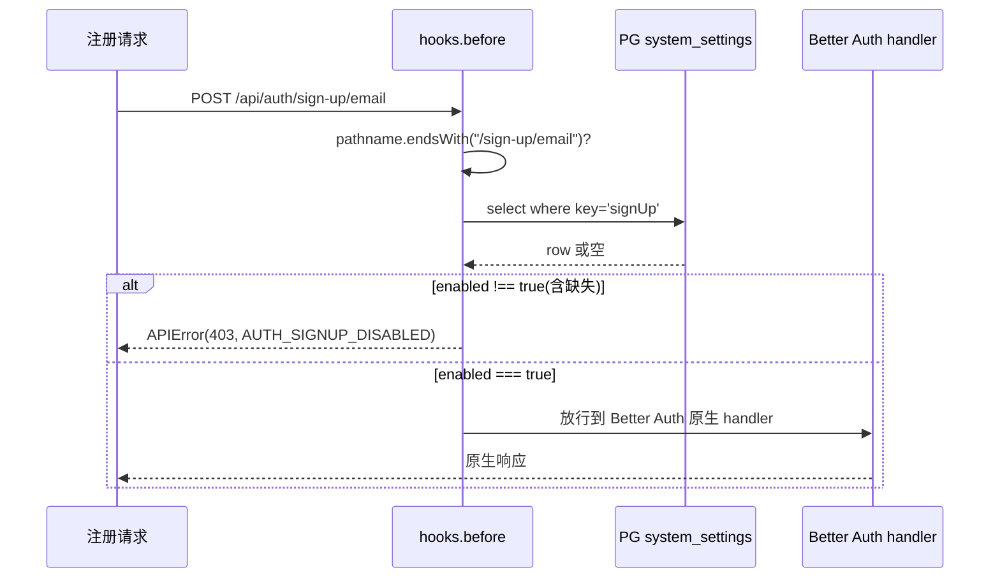

# Feature: system-settings（系统配置）

## 1. Background

系统需要部分配置在运行时可编辑（管理员通过 UI 修改），不再依赖改 env 重启。第一个需求是"是否开启用户注册"开关。ADR-0007 决定用 DB `system_settings` 表存运行时配置 + Better Auth `hooks.before` 控制注册开关（移除 `env.DISABLE_SIGN_UP`，DB 为唯一开关）。

## 2. Goals

- `system_settings` 表存储运行时可编辑配置（key-value JSON 模式）。
- `GET/PATCH /api/v1/settings` 提供配置读写 API（settings.read/settings.update 权限）。
- sign-up 注册开关用 Better Auth `hooks.before` 拦截（直接查 DB `system_settings.signUp.enabled`，关闭或缺失时抛 APIError）。

## 3. Non-goals

- 所有 env 配置搬进 DB（env 只留启动必需且不可热改的基础设施配置）。
- 配置变更审计 log（独立 feature 推进）。
- 配置变更通知/事件（单实例部署，无需事件总线）。

## 4. API Surface

| Method | Path | OperationId | Auth | Description |
| --- | --- | --- | --- | --- |
| GET | `/api/v1/settings` | `listSettings` | settings.read | 列出全部配置 |
| PATCH | `/api/v1/settings/{key}` | `updateSetting` | settings.update | upsert 一条配置 |

sign-up 拦截在 `better-auth.ts` 的 `hooks.before` 配置里声明：BA 用户级 hook 对所有 `/api/auth/*` 触发、无路径 matcher；用 `ctx.request?.url` 解析后 `new URL(url).pathname.endsWith("/sign-up/email")` 判断端点（pathname 去 query/fragment，防 `?foo` 绕过）。直接查 `system_settings` 表（`core/` 禁止 import `features/`，不经 `SystemSettingService`）；jsonb value 用本地 zod `safeParse` 窄化，`enabled !== true`（含记录缺失或脏数据）时抛 `APIError`（`AUTH_SIGNUP_DISABLED`）。不暴露独立端点。

## 5. Request / Response

统一 envelope。`PATCH /settings/{key}` body 为 `{ value: <json> }`，upsert 语义（不存在则创建）。`GET /settings` 返回全部配置数组（仅含 value 符合 registry schema 的行，脏数据降级过滤）。

## 6. Auth & Permissions

`features/system-settings/permissions.ts` 声明 `settings.read` / `settings.update`，展开到 `permissions-catalog.ts`。

| Permission | Description |
| --- | --- |
| `settings.read` | 查看系统设置 |
| `settings.update` | 修改系统设置 |

## 7. Data Model

- `system_settings`：`key` text PK（配置名，如 `"signUp"`）、`value` jsonb notNull（JSON，如 `{ "enabled": true }`）、`updatedAt` timestamptz、`updatedByUserId` text ->user onDelete set null（审计）。无 id/createdAt（key 天然主键）。
- sign-up 单开关语义：`signUp.enabled` 唯一控制注册（移除 `env.DISABLE_SIGN_UP`）。`enabled=true` 放行；`enabled=false` 或记录缺失 -> hooks.before 拒绝（未配置即禁，安全默认）。生产 migrate 后无 seed 即禁；dev seed `enabled=true` 开箱允许。

## 8. Error Codes

| Code | HTTP Status | Description |
| --- | --- | --- |
| `COMMON_FORBIDDEN` | 403 | 无 settings.read/settings.update |
| `COMMON_UNAUTHORIZED` | 401 | 未认证 |
| `AUTH_SIGNUP_DISABLED` | 403 | 注册已关闭（`hooks.before` 检查 `signUp.enabled !== true`，含记录缺失） |

## 9. Request Flow

sign-up 拦截流程（Better Auth `hooks.before`，不经 requirePermission，直接查表不经 service）：

## 10. Logging & Audit

配置变更走结构化日志（LogLayer，带 requestId + userId）。audit log 暂未实现（见 Non-goals）。

## 11. Test Cases

- unit：`features/system-settings/system-settings.test.ts`（鉴权 403 + handler->service 接线 + upsert 语义 + value 校验）
- integration：`tests/integration/system-settings/settings.test.ts`（settings 写入读取 + sign-up hooks.before 三态：`enabled=true` 放行 / `enabled=false` 拒绝 403 / 记录缺失拒绝 403）

## 12. Rollout / Migration Notes

- migration `0004`：新建 `system_settings` 表。
- `seed.ts` 加 dev 初始 `signUp: { enabled: true }`（开发默认开注册）。
- `env.DISABLE_SIGN_UP` 已移除：sign-up 由 DB `signUp.enabled` 唯一控制；生产 migrate 后无 seed 即禁（安全默认）。
- 配置 key 命名约定：camelCase（如 `signUp`、`passwordPolicy`），value 用 JSON 对象便于扩展字段。
