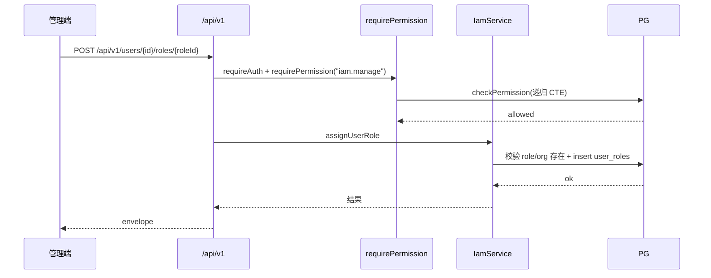

# Feature: iam（权限管理）

## 1. Background

ADR-0004 决定权限层自建，读侧（schema / 递归 CTE 检查 / 目录同步 / 请求级 memoize）先行落地，但写侧（管理 API + bootstrap）缺失，导致权限数据无 API 入口，只能 seed/直连 DB。本 feature 补全写侧，让权限层对真实用户可用。

## 2. Goals

- `pnpm db:bootstrap` 引导第一个 admin（破鸡生蛋）。
- `/api/v1/me` 暴露当前用户身份与有效权限全集。
- 权限目录查询（代码同步，只读）。
- 角色 CRUD（实例角色，`source` 区分代码/实例）。
- 用户授权（授角色 / 直接授权 allow|deny / 撤销 / 查全集），支持组织 scope + 过期。
- 组织树 CRUD（防环）。

## 3. Non-goals

- 分级管理员（对目标 org 二次 `iam.manage` 检查）。
- Redis 权限缓存 + 事件失效（第一版 ALS 请求级 memoize 足够）。
- 自定义角色之外的实例角色复杂策略；过期记录 housekeeping。
- audit log（关键写操作审计，独立 feature 推进）。
- 用户身份 CRUD（走 Better Auth 原生 sign-up/sign-in；管理员代创建账号按需另建）。

## 4. API Surface

| Method | Path | OperationId | Auth | Description |
| --- | --- | --- | --- | --- |
| GET | `/api/v1/me` | `getMe` | 认证 | 当前用户 + 有效权限全集 |
| GET | `/api/v1/permissions` | `listPermissions` | iam.read | 权限目录（只读） |
| GET | `/api/v1/roles` | `listRoles` | iam.read | 角色列表（含 source） |
| POST | `/api/v1/roles` | `createRole` | iam.manage | 建实例角色 |
| PATCH | `/api/v1/roles/{roleId}` | `updateRole` | iam.manage | 改实例角色 |
| DELETE | `/api/v1/roles/{roleId}` | `deleteRole` | iam.manage | 删实例角色（cascade） |
| GET | `/api/v1/roles/{roleId}/permissions` | `listRolePermissions` | iam.read | 角色含的权限 |
| POST | `/api/v1/roles/{roleId}/permissions` | `assignRolePermissions` | iam.manage | 给角色配权限 |
| DELETE | `/api/v1/roles/{roleId}/permissions/{permission}` | `deleteRolePermission` | iam.manage | 撤角色权限 |
| POST | `/api/v1/users/{userId}/roles/{roleId}` | `assignUserRole` | iam.manage | 授用户角色 |
| DELETE | `/api/v1/users/{userId}/roles/{roleId}` | `deleteUserRole` | iam.manage | 撤用户角色（query orgId） |
| POST | `/api/v1/users/{userId}/permissions/{permission}` | `assignUserPermission` | iam.manage | 直接授权 allow/deny |
| DELETE | `/api/v1/users/{userId}/permissions/{permission}` | `deleteUserPermission` | iam.manage | 撤直接权限（query orgId） |
| GET | `/api/v1/users/{userId}/permissions` | `listUserPermissions` | iam.read | 用户有效权限全集（query orgId） |
| GET | `/api/v1/organizations` | `listOrganizations` | iam.read | 组织列表（扁平） |
| POST | `/api/v1/organizations` | `createOrganization` | iam.manage | 建组织 |
| GET | `/api/v1/organizations/{orgId}` | `getOrganization` | iam.read | 组织详情 |
| PATCH | `/api/v1/organizations/{orgId}` | `updateOrganization` | iam.manage | 改组织（防环） |
| DELETE | `/api/v1/organizations/{orgId}` | `deleteOrganization` | iam.manage | 删组织（有子拒绝） |

## 5. Request / Response

统一 envelope（`success` / `code` / `data` / `error` / `meta.requestId`）。列表不分页（第一版全量返回，按 name/createdAt 确定性排序）。`DELETE` 撤销类用 query `orgId` 定位（user_roles/user_permissions PK 含 orgId）。

## 6. Auth & Permissions

`features/iam/permissions.ts` 声明 `iam.read` / `iam.manage`，展开到 `APP_PERMISSIONS`。admin 角色（代码同步）含全部权限（含 iam.*）。

| Permission | Description |
| --- | --- |
| `iam.read` | 查看组织/角色/授权/权限目录 |
| `iam.manage` | 管理（建/改/删）组织/角色/授权 |

第一版全局 admin：根组织 admin 因祖先遍历对任意子组织 `iam.manage` 通过。`/api/v1/me` 仅需认证（看自己）。

## 7. Data Model

- `roles`：加 `source` 列（`code` | `instance`，default `instance`）。`code` = 代码同步（admin），`instance` = 管理 API 创建。
- `role_permissions` / `user_roles` / `user_permissions`：授权关联，均带 orgId + 可选 expiresAt；外键 cascade。
- `organizations`：树形（parentId 自引用，CYCLE 兜底）。
- `permissions`：代码同步目录，管理 API 只读。
- `IamPermissionChecker`（`features/iam/permission-checker.ts`）：`PermissionChecker` 的本地 Adapter（PDP），实现 check/list-effective 的递归 CTE；不含 memoize（由 core `PermissionService` 装饰）。可整体替换为外部 PDP（见 [authorization.md 边界划分](../conventions/authorization.md)）。

## 8. Error Codes

第一版复用 `COMMON_*`，不引入 `IAM_*` 专用码。

| Code | HTTP Status | Description |
| --- | --- | --- |
| `COMMON_NOT_FOUND` | 404 | 角色/组织/权限/授权不存在，或对 code 角色改删 |
| `COMMON_CONFLICT` | 409 | 角色名重复；组织形成环；删有子组织 |
| `COMMON_FORBIDDEN` | 403 | 无 iam.read/iam.manage |
| `COMMON_UNAUTHORIZED` | 401 | 未认证 |

## 9. Request Flow

## 10. Logging & Audit

管理写操作走结构化日志（LogLayer，带 requestId）。关键写操作的 audit log 暂未实现（见 Non-goals）。

## 11. Test Cases

- unit：`features/iam/iam.test.ts`（路由鉴权 401/403/200/404/409 + handler 调 service）、`features/me/me.test.ts`
- integration：`tests/integration/authorization/iam-roles.test.ts`（source 保护、cascade）、`iam-assignments.test.ts`（授角色/deny/祖先/过期/撤销全语义）、`iam-organizations.test.ts`（建树/防环/删除约束）、`list-effective.test.ts`（全集算法）

## 12. Rollout / Migration Notes

- migration `0003`：`roles` 加 `source` 列（default `instance`）。`sync.ts` 用 `onConflictDoUpdate` 强制 admin `source='code'`（修正旧库被 default 覆盖的情况）。
- 部署顺序：`db:migrate` -> `db:bootstrap`（造第一个 admin）-> start（sync 同步目录 + admin 角色）。
- `bootstrap` 幂等：组织已存在跳过；admin email 已存在报错（不覆盖密码）。
